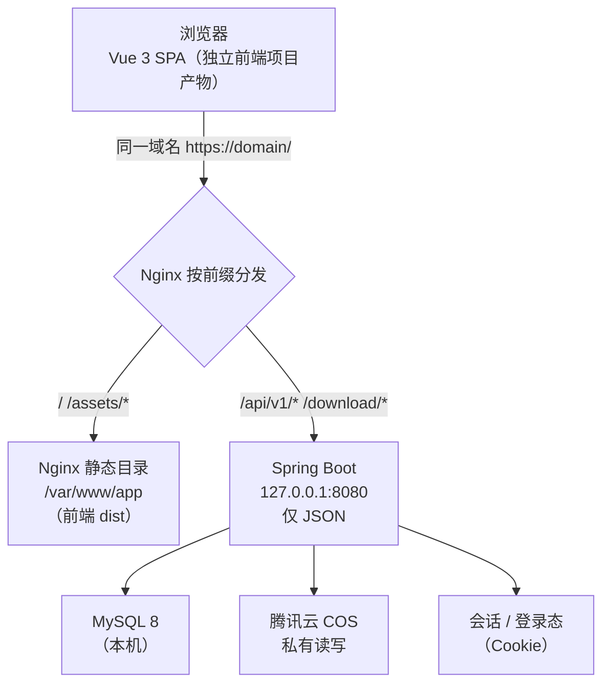

# 前后端分离架构说明

- **文档版本**：v1.2
- **创建日期**：2026-09-21
- **最后更新**：2026-09-21（§十 四项待确认全部定稿；§十一 COS 并发量化）
- **文档状态**：**架构已定稿，无未决项**（严格前后端分离）
- **关联文档**：`技术选型与工程结构（方案对比）.md`（v0.4，§三/§五 已作废）、`docs/doc/01-需求与范围/个人工具展示网站需求文档（PRD）.md` v1.7、`附录C-接口清单与统一约定.md` v0.8、`docs/doc/01-需求与范围/个人工具网站｜一期精简核心功能清单.md` v1.7、ADR-001/002
- **文档定位**：本文定义"系统怎么分层、怎么部署、怎么演进"。**接口契约的唯一事实源仍是附录C**，本文只补充前后端分离形态下的协作约定

---

## 一、结论先行

**架构定为严格前后端分离**：前端独立项目（Vue 3 + Vite）负责全部页面与交互，后端独立服务（Java 17 + Spring Boot 3.x）**仅输出 JSON API，不含任何模板引擎、不输出任何 HTML 页面**。双方以附录C 的接口契约协作，**同源部署**（同一域名，路径区分）以避免 CORS 与预检开销。

**必须先说清的一项风险**：你给的三个条件——前后端分离 + 静态资源由源站提供 + 服务器 3 Mbps——**三者叠加会与"首屏 P75 ≤1.5s"直接冲突**。实测测算（§7）：首屏资源约 163 KB（gzip 后），在 375 KB/s 的总带宽下，**并发 3 人是达标上限，5 人即 2.1 秒、10 人达 4.2 秒**。

| 并发人数 | 理论首屏传输耗时 | 判定 |
|---|---|---|
| 1 人 | 0.42 s | 达标 |
| 3 人 | 1.27 s | **达标上限** |
| 5 人 | 2.12 s | 超标 |
| 10 人 | 4.24 s | 超标 |

> 该测算未计入 RTT、TLS 握手与 JS 解析执行时间，**实际只会更差**。

**因此本架构把"前端产物体积"列为硬约束**（首屏 gzip 后 ≤163 KB，其中 JS ≤130 KB），并预设了**不引入 CDN 即可降压的演进第一步**：把前端构建产物迁至 COS 静态托管（§8 阶段 1）。这一步零 CDN 成本，能把源站带宽压力降到只承载 API 流量（几 KB 级），与你的"暂不引入 CDN"要求不冲突——**COS 静态托管不是 CDN**。

另外两项诚实的代价标注：**SEO 需额外方案**（SPA 对爬虫不友好，§9 列入演进）、**首屏弱于服务端渲染**（这是分离架构的固有代价，非实现问题）。按你"日活约 100 人、一期不公开上线"的前提，这两项在一期可接受。

---

## 二、设计前提与约束

### 2.1 你给定的四条前提

| # | 前提 | 本文如何落实 |
|---|---|---|
| 1 | 日活约 100 人，流量集中广西，控制复杂度、避免过度设计 | 不引入 Redis、消息队列、Docker、服务网格、微前端；单实例 + 单库 + 单机 Nginx；前端不引入重型 UI 库 |
| 2 | 暂不引入 CDN，静态资源与接口均由源站提供 | 前端产物由源站 Nginx 提供；演进第一步是迁 COS 静态托管（非 CDN），见 §8 |
| 3 | 严格前后端分离，禁止服务端渲染/模板渲染/后端输出页面 | 后端移除 Thymeleaf，仅 `@RestController`；后端构建产物中不含任何 `.html` 模板；§6 定义协作契约 |
| 4 | 单台服务器、低运维成本，给出演进路径 | §7 部署方案（systemd + Nginx，无容器）；§8 四阶段演进 |

### 2.2 边界处理 ✅ 已确认（2026-09-21）

"静态资源均由源站提供"在本项目里有一个歧义点。**NecoOcean 已确认按如下理解执行**：

| 资源类型 | 落点 | 理由 |
|---|---|---|
| 前端构建产物（HTML / JS / CSS） | **源站 Nginx** | 符合"静态资源由源站提供"的字面要求 |
| **封面图、工具文件下载** | **腾讯云 COS** | 这是 PRD §4.3 与 ADR-001 已定的硬约束：文件 ≤200 MB，**不可能经 3 Mbps 源站下发**；且 COS 直链不是 CDN |

即：**"静态资源由源站提供"= "前端产物由源站提供"，图片与下载文件仍走 COS**。若封面图也走源站，首屏风险会进一步恶化（多张封面图 × 每个访客），已排除该方案。

### 2.3 沿用不变的技术基线

Java 17 + Spring Boot 3.x、MySQL 8、腾讯云轻量服务器（4C4G / 3 Mbps）+ COS 100 GB、留言审核分期机制、48 个接口契约——均沿用《技术选型与工程结构》v0.2 与附录C v0.5，**唯一变更是移除 Thymeleaf 服务端渲染**。

---

## 三、整体架构

**图 3-1　整体架构（同源部署）**



> **图例**：`-->` 请求流向；`{}` 分发节点；`||` 换行。
> **Nginx 按前缀分发规则**：

| 路径 | 去向 | 说明 |
|---|---|---|
| `/`、`/assets/*`、`/*.js`、`/*.css` | Nginx 静态目录（前端 dist） | 带内容指纹的文件长缓存 |
| `/api/v1/**` | 反代到 Spring Boot | 仅 JSON；统一信封 |
| `/download/{file_id}` | 反代到 Spring Boot | 后端校验后 **302 至 COS 预签名 URL**，文件不经源站 |
| `/admin`（前端路由） | Nginx 静态目录 + `try_files` 回退 | 后台页面也是前端路由，非后端渲染 |
| 封面图 URL | **直连 COS 公开前缀 `covers/`** | 不经过源站，不占 3 Mbps |

**关键决策：同源部署，不配置 CORS。** 前端与 API 共用同一域名（仅路径不同），浏览器视为同源，因此：无跨域预检（OPTIONS）请求、无 CORS 头维护、Cookie 天然可携带。这是"避免过度设计"在分离架构下最直接的收益——**只有当前后端不同域名时才需要 CORS**。

---

## 四、前端项目

### 4.1 技术选型与体积预算

| 项 | 选型 | 说明 |
|---|---|---|
| 框架 | **Vue 3 + Vite** | 运行时 gzip 约 34 KB，生态与中文资料充分；相较 React 体积更省 |
| 路由 | **Vue Router 4（history 模式）** | URL 干净可分享；Nginx 配一条 `try_files` 即可 |
| 状态管理 | **不引入 Pinia/Vuex** | 页面状态简单（工具列表/详情/留言），组件内 `ref` 足够——这是"避免过度设计"的具体体现 |
| HTTP | **原生 `fetch` 薄封装** | 不用 axios 也够；若你偏好 axios 可加（约 13 KB gzip，在预算内） |
| UI 库 | **不引入**（自建极简 CSS） | Element Plus / Ant Design 动辄数百 KB，会直接击穿体积预算 |
| 构建 | Vite | 产物带内容指纹，便于长缓存 |

**体积硬预算（首屏、gzip 后）**

| 资源 | 预算 | 超出时的处理 |
|---|---|---|
| JS（Vue runtime + app + router） | **≤130 KB** | 路由级代码分割（专题页/后台各自独立 chunk）；超标则评估换 Preact |
| CSS | **≤15 KB** | 极简自建样式，避免引入完整 CSS 框架 |
| HTML | ≤3 KB | 天然满足 |
| 首屏 API 响应 | ≤15 KB | 后端分页默认 20 条 + gzip |
| **首屏合计** | **≤163 KB** | 超过即视为阻塞问题，需先优化再上线 |

### 4.2 目录结构

**图 4-1　前端目录结构**

```
necoocean-tools-frontend/
├── index.html
├── vite.config.js
├── package.json
├── public/                        # 不参与构建的静态文件（favicon 等）
└── src/
    ├── main.js                    # 应用入口：挂载、路由、全局样式
    ├── App.vue
    ├── router/
    │   └── index.js               # 路由表：/、/tool/:slug、/about、/privacy、/admin/*
    ├── api/                       # 【接口适配层，唯一发请求的地方】
    │   ├── http.js                # fetch 封装：统一信封解析、错误码映射、CSRF 头注入
    │   ├── publicApi.js           # C-01 ~ C-08（首页、专题页、留言列表/提交、下载）
    │   └── adminApi.js            # C-09 ~ C-46（登录、工具、分类、留言、文件、设置、导出）
    ├── views/
    │   ├── HomeView.vue           # 首页：全量工具卡片 + 分类筛选 + 搜索
    │   ├── ToolDetailView.vue     # 工具专题页：详情/日志/下载区/留言区
    │   ├── AboutView.vue
    │   ├── PrivacyView.vue
    │   └── admin/
    │       ├── LoginView.vue
    │       ├── ToolsView.vue      # 工具管理（含文件上传）
    │       ├── MessagesView.vue   # 留言管理（含待复核队列、置顶、状态）
    │       ├── CategoriesView.vue
    │       └── SettingsView.vue
    ├── components/                # 可复用组件：ToolCard、MessageItem、Pagination、FileUploader
    ├── utils/
    │   ├── csrf.js                # 从 Cookie 读 XSRF-TOKEN
    │   └── format.js              # 时间/文件大小格式化
    └── styles/                    # 极简 CSS（不引入 CSS 框架）
```

### 4.3 前端职责边界

**负责**：路由与页面渲染、交互与表单校验（体验层校验）、轮询（30 秒刷新留言）、文件上传直传 COS（拿到后端预签名后 PUT）、错误提示文案、响应式布局。

**不负责**：业务规则判定（留言是否公开、分类能否删除、限流、审核状态流转）——这些一律由后端裁定，前端只做提示。**典型反例**：前端不得自行判断"命中关键词就不提交"，关键词行为由后端决定（PRD §4.2：只标记不拦截）。

---

## 五、后端项目

### 5.1 技术栈与"不得输出页面"的硬约束

| 项 | 选型 |
|---|---|
| 框架 | Java 17 + Spring Boot 3.x |
| 视图层 | **无**（移除 `spring-boot-starter-thymeleaf` 依赖，`src/main/resources/` 下不保留 `templates/`） |
| 接口形态 | 仅 `@RestController`，全部返回 `application/json` |
| ORM/迁移 | Spring Data JPA + Flyway |
| 存储 | 腾讯云 COS SDK |

**验收口径**：后端构建产物（jar）内**不得包含任何 `.html` 模板文件**；除 `/download/{file_id}` 的 302 跳转外，后端所有响应 `Content-Type` 必须为 `application/json`。这条写进交付验收。

**唯一例外**：`/download/{file_id}` 返回 302（无响应体），这是附录C 已定的契约，不违反"不输出页面"。

### 5.2 目录结构

**图 5-1　后端目录结构**

```
necoocean-tools-backend/
├── pom.xml
└── src/main/java/com/necoocean/tools/
    ├── ToolsApplication.java
    ├── config/
    │   ├── WebConfig.java           # 拦截器、真实 IP 解析（X-Forwarded-For 首段）
    │   ├── SecurityConfig.java      # Session、密码编码器、**CSRF 双提交**
    │   ├── CosConfig.java           # COS 客户端、预签名参数（上传 60min / 下载 5min）
    │   └── JacksonConfig.java       # 时间格式 ISO 8601 +08:00、null 处理
    ├── common/
    │   ├── ApiResponse.java         # 统一信封 {code, message, data}
    │   ├── ErrorCode.java           # 错误码枚举（附录C §4，30 条）
    │   ├── BizException.java
    │   ├── GlobalExceptionHandler.java   # @RestControllerAdvice 全局兜底
    │   └── PageResult.java          # {page, page_size, total, items}
    ├── logging/                     # 【首个要建的横切能力】
    │   ├── RequestLogFilter.java    # traceId 贯穿
    │   ├── LogMasker.java           # 邮箱 / IP 脱敏
    │   └── logback-spring.xml       # 结构化 + 轮转 + 保留份数
    ├── domain/
    │   ├── entity/                  # 8 个实体（PRD §8）
    │   └── repository/              # Spring Data JPA
    ├── dto/
    │   ├── publicapi/               # 公开接口 DTO（输出白名单，从结构上排除 contact_email）
    │   └── admin/
    ├── service/                     # 业务规则唯一落点
    │   ├── MessageService.java      # 审核流转、status 与 audit_status 独立性
    │   ├── FileService.java         # is_latest / latest_version 事务同步（PRD §8.9）
    │   ├── ToolService.java / CategoryService.java  # 含"其他工具"不可删除
    │   ├── SiteSettingService.java  # KV + 键白名单
    │   ├── ExportService.java       # CSV + JSON
    │   └── CosService.java          # 预签名上传/下载、对象键、异常文件检测
    ├── web/
    │   ├── publicapi/               # C-01 ~ C-08（含 C-04b）
    │   ├── admin/                   # C-09 ~ C-46（C-47 延二期）
    │   └── DownloadController.java  # /download/{file_id} → 302
    ├── security/
    │   ├── RateLimitInterceptor.java    # IP 哈希 5 条/60 秒
    │   ├── CsrfInterceptor.java         # 双提交校验（公开写接口豁免）
    │   └── LoginAttemptService.java     # 5 次失败锁定 15 分钟
    └── scheduler/
        └── OrphanCleanupJob.java    # 清理无记录的对象存储残留
```

**与上一版（服务端渲染）的差异**：删除 `resources/templates/` 与 `PageController`，新增 `JacksonConfig`（前后端分离下 JSON 序列化约定集中管理）。其余分层不变。

### 5.3 后端职责边界

**负责**：全部业务规则与数据一致性（含 PRD §8.9 的 `is_latest` 事务同步、审核状态流转、"其他工具"分类保护、限流、CSRF、错误码）、对象存储签名签发、数据导出。

**不负责**：页面渲染、路由跳转、任何 HTML 片段生成。

---

## 六、接口协作约定

> 接口清单、字段、错误码的**唯一事实源是附录C v0.5**（48 个接口、30 条错误码）。以下只补充前后端分离形态下必须约定的协作规则——这些是附录C 尚未覆盖的部分。

### 6.1 部署形态与跨域

- **同源部署**：前端与 API 同一域名、同协议、同端口，仅路径不同（`/` 与 `/api/v1/`）。**因此不启用 CORS**，后端不返回 `Access-Control-*` 头，也不处理 OPTIONS 预检。
- 若未来前后端分域名（如前端迁 COS 静态托管并绑定独立域名），则**必须**在后端增加 CORS 白名单（仅允许该前端域名，`Allow-Credentials: true`），并注意 `SameSite` 需设为 `None; Secure`。这一步在 §8 阶段 1 触发。

### 6.2 认证与会话

| 项 | 约定 |
|---|---|
| 方式 | **Cookie Session**（不采用 JWT / localStorage 存 token） |
| Cookie 属性 | `HttpOnly`（防 XSS 读取）、`SameSite=Lax`、`Secure`、`Path=/` |
| 前端行为 | 请求一律带 `credentials: 'include'`；**前端不读取、不存储会话标识** |
| 登录态判断 | 前端不自行判断，以接口返回的 `40101` 为准并跳转登录页 |

选 Cookie 而非 JWT 的理由：单管理员 + 同源部署下，Cookie 由浏览器自动管理，前端无需处理刷新、过期、存储，**复杂度最低**，符合"避免过度设计"。

### 6.3 CSRF 双提交

| 项 | 约定 |
|---|---|
| 后端 | 登录成功后下发 `XSRF-TOKEN` Cookie（**非 HttpOnly**，供前端读取） |
| 前端 | `utils/csrf.js` 从 Cookie 读取该值，所有**写请求**（POST/PUT/DELETE）附加请求头 `X-XSRF-TOKEN` |
| 后端校验 | 比对 Cookie 值与请求头值是否一致，不一致返回 `403xx` |
| 豁免 | 公开写接口（留言提交 C-07）无登录态、无越权前提，**豁免 CSRF**（附录C §1 已定），仍受限流约束 |

### 6.4 响应与错误处理

- 统一信封：`{"code": 0, "message": "ok", "data": {...}}`；**HTTP 状态码与 `code` 双轨**（附录C §1）
- 前端 `http.js` 统一解析：`code === 0` 取 `data`；否则按 `code` 映射用户文案并提示
- 分页响应固定为 `{page, page_size, total, items}`；前端分页组件只依赖这四个字段
- 时间统一 ISO 8601 带 `+08:00`；枚举返回 `{value, label}` 双字段（前端直接用 `label` 展示，避免前端硬编码枚举映射）
- **`platforms` 等多选字段以数组传输**（库内逗号分隔，接口层数组，PRD §8.1）

### 6.5 文件上传与下载（前后端分离下的特殊流程）

```
1. 前端 → 后端 C-28（upload-ticket）：提交 ext / file_size，后端预校验并签发预签名 PUT 凭证（60 分钟）
2. 前端 → COS：直传文件（不经后端、不经源站）
3. 前端 → 后端 C-29（complete）：提交对象键 + 前端计算的 SHA-256（方案 A），后端格式校验后落库
```

- 下载：前端跳转 `/download/{file_id}` → 后端 302 至 COS 预签名地址（5 分钟）
- **封面图**：`covers/` 前缀公开读，前端直接引用 COS URL，不经过源站

### 6.6 实时性

- 留言刷新：**前端轮询 C-06，间隔固定 30 秒**（PRD §4.1 已定，客户端常量）
- 一期不引入 WebSocket（避免过度设计）

---

## 七、部署方案（单台服务器、低运维）

### 7.1 部署拓扑

**图 7-1　部署拓扑**

```
腾讯云轻量服务器（上海五区 · 4C4G · SSD 40G · 3 Mbps）
├── Nginx（唯一监听 80/443）
│   ├── / 、/assets/*  → /var/www/necoocean-tools/（前端 dist，长缓存 + gzip）
│   ├── /api/v1/*      → proxy_pass http://127.0.0.1:8080
│   └── /download/*    → proxy_pass http://127.0.0.1:8080（返回 302）
├── Spring Boot（systemd 守护，仅监听 127.0.0.1:8080）
└── MySQL 8（本机，仅监听 127.0.0.1）

外部服务（不经源站）：
└── 腾讯云 COS（上海）—— covers/ 公开前缀 + 预签名直连下载
```

### 7.2 Nginx 关键配置

```nginx
server {
    listen 443 ssl http2;
    server_name <your-domain>;
    # ssl_certificate / ssl_certificate_key ...

    root /var/www/necoocean-tools;
    index index.html;

    # 1) 压缩：3 Mbps 下必开
    gzip on;
    gzip_types text/html text/css application/javascript application/json;
    gzip_min_length 1024;
    gzip_comp_level 6;

    # 2) 带指纹的构建产物：长缓存
    location /assets/ {
        expires 1y;
        add_header Cache-Control "public, immutable";
        try_files $uri =404;
    }

    # 3) SPA history 路由回退（含 /admin）
    location / {
        try_files $uri $uri/ /index.html;
    }

    # 4) API 反代：必须传真实 IP（否则限流误伤）
    location /api/ {
        proxy_pass http://127.0.0.1:8080;
        proxy_set_header Host $host;
        proxy_set_header X-Real-IP $remote_addr;
        proxy_set_header X-Forwarded-For $proxy_add_x_forwarded_for;
        proxy_set_header X-Forwarded-Proto $scheme;
    }

    location /download/ {
        proxy_pass http://127.0.0.1:8080;   # 后端返回 302 至 COS 签名地址
        proxy_set_header X-Forwarded-For $proxy_add_x_forwarded_for;
    }
}
```

**后端仅监听 `127.0.0.1:8080`**（不暴露公网端口），所有外部访问经 Nginx。MySQL 同样仅监听回环。安全面最小化，且无需配置防火墙白名单。

### 7.3 发布流程（低运维）

| 组件 | 流程 |
|---|---|
| 前端 | **本地 `npm run build` → 上传 `dist/` 到服务器**（`scp` / `rsync`）。**服务器不安装 Node**——省内存、省维护，4 GB 内存留给 Java 与 MySQL |
| 后端 | 本地 `mvn package` → 上传 jar → `systemctl restart necoocean-tools` |
| 数据库 | Flyway 在应用启动时自动迁移，无需手工执行 SQL |
| 备份 | `mysqldump` 每日一次到本地目录 + 定期同步到 COS（脚本 + cron，几行即可） |

一期不做 CI/CD、不做容器化——日活 100 人的规模下，脚本化发布已足够，引入 Docker 只会增加运维面。

### 7.4 带宽与性能预算（务必遵守）

| 措施 | 说明 |
|---|---|
| **gzip 全开** | 3 Mbps 下这是性价比最高的一项，文本资源可压缩至 1/3 |
| **构建产物长缓存 + 内容指纹** | 复访用户本地命中，首屏近乎零传输成本 |
| **图片一律走 COS** | 封面图不占源站带宽；首页列表用缩略图（≤120 KB/张） |
| **API 响应精简 + gzip** | 分页默认 20 条；列表接口不返回大字段（如教程正文） |
| **上线前实测** | 浏览器 DevTools 限速 3 Mbps 模拟，验证 P75 ≤1.5s；**并发 ≥5 人不达标时直接走 §8 阶段 1** |

---

## 八、演进路径

> 原则：每一步都由**明确的触发条件**启动，且改动范围可控。前两步**不需要引入 CDN**。

| 阶段 | 触发条件 | 动作 | 改动量 | 是否引入 CDN |
|---|---|---|---|---|
| **0（当前）** | 日活 ~100，并发峰值 ≤3 | 单机：Nginx + Spring Boot + MySQL 本机；前端产物由源站提供 | —— | 否 |
| **1** | 并发峰值 >3，或实测首屏 P75 >1.5s | **前端产物迁 COS 静态托管 + 自定义域名**（如 `static.<domain>`）；源站只承载 API；后端加 CORS 白名单（仅该域名） | Nginx 改一行静态目录 → 改为反代/重写；后端加 CORS 配置；**业务代码不动** | **否**（COS 静态托管非 CDN） |
| **2** | 流量继续增长，或广西以外访问占比上升 | COS 接 **CDN** 加速（静态资源 + 封面图 + 下载文件）；配置 Referer 防盗链 | 改资源域名 + CDN 配置；业务代码不动 | **是** |
| **3** | 应用 CPU/内存成为瓶颈 | 后端多实例 + Nginx 负载均衡；**Session 外置**（Redis 或存库——多实例下必须处理）；数据库迁 TencentDB 托管 | 需改会话存储方式；其余不动 | 否 |
| **4** | 带宽长期吃紧 | 升级轻量服务器带宽套餐（腾讯云支持升级），或按阶段 1/2 已分流后重新评估 | 配置层面 | 视情况 |

**阶段 1 是关键的低成本降压点**：它把源站出网从"HTML + JS + CSS + API"降到"仅 API"（单次几 KB），3 Mbps 的约束基本解除，且**不违反你"暂不引入 CDN"的要求**——COS 静态托管与 CDN 是两回事（CDN 是在 COS 之上再叠加的加速层，阶段 2 才引入）。

---

## 九、前后端分离的确定代价（诚实标注）

| 代价 | 影响 | 应对 |
|---|---|---|
| **首屏弱于服务端渲染** | 需下载 JS 再渲染，3 Mbps 下并发 3 人即达上限 | §7.4 性能预算 + §8 阶段 1 |
| **SEO 需额外方案** | SPA 首屏 HTML 为空壳，爬虫难以抓取工具页内容 | 一期不公开上线、日活 100 人，**非阻塞**；若后续要做 SEO，再引入预渲染（构建期生成静态 HTML）或 SSR，列入演进而非一期范围 |
| 前端需维护构建链 | 多一个 Node 构建环节 | 服务器不装 Node，本地构建后上传（§7.3） |

---

## 十、待确认事项 → **✅ 已于 2026-09-21 16:19 全部确认**

| # | 事项 | **确认结果** |
|---|---|---|
| 1 | "静态资源由源站提供"是否含封面图与下载文件 | ✅ **确认为"仅前端构建产物由源站提供"**；封面图与下载文件走 COS 预签名直链（与 §2.2 默认处理一致） |
| 2 | 前端框架 | ✅ **Vue 3 + Vite**（不引 Pinia / UI 组件库） |
| 3 | 仓库形态 | ✅ **前后端两个独立仓库**（`necoocean-tools-frontend` / `-backend`）。**2026-09-21 扩展为「三仓库 + 本地工作区」**：补入文档仓库，工作区根不做仓库——已升格为**跨项目强制规范**，见 `docs/文档规范/仓库形态规范.md` v1.2 与 ADR-003 |
| 4 | 首屏指标口径 | ✅ **照 §5.1 修订定稿**："≥50 并发"= 持续请求节奏下的虚拟用户数；首屏达标场景为**并发峰值 ≤3 人**，超出执行 §8 阶段 1 |

> **✅ 本文档无未决项。架构、目录结构、接口协作、部署与演进路径均已定稿，可正式进入开发。**
>
> 另三项低影响参数（类型白名单补充 `.whl`/`.AppImage`/`.deb`、导出可选含邮箱、"开发时间"字段保留）已于同一时间确认，落点见《待确认参数台账》A-18~A-20。


---

## 十一、COS 承载静态文件与软件包对并发的影响（量化）

本节回答一个具体问题：**把软件包与静态文件交给 COS 管理后，并发上限变成多少？**

### 11.1 必须区分三条流量路径

并发不是一个数，要看流量走哪条管道。三条路径的天花板相差三个数量级：

| 路径 | 承载方 | 单次体积 | 并发天花板 | 说明 |
|---|---|---|---|---|
| ① 动态 API | 源站 Nginx → Spring Boot | gzip 后约 2~10 KB | **≈58 并发用户**（按 1.5s 加载窗口折算） | 384 KB/s ÷ 10 KB/浏览 × 1.5s ≈ 57.6 |
| ② 前端产物（JS/CSS/HTML） | 源站 Nginx（一期） | 163 KB/首屏 | **≈3 并发用户** | 384 KB/s ÷ 173 KB/浏览 × 1.5s ≈ 3.3；**这是真瓶颈** |
| ③ 软件包下载 / 封面图 | COS 预签名直链 | 最大 200 MB | **≈154 人同时满速** | 受 15 Gbit/s 配额约束；实际先受限于用户侧宽带 |

> COS 配额来源：腾讯云官方文档《对象存储 规格与限制》——中国大陆公有云地域**单账号单地域默认上下行各 15 Gbit/s**，每桶**读请求 30000 QPS / 写请求 30000 QPS**，**单文件下载热点频控 1000 QPS**。15 Gbit/s 是源站 3 Mbps 的 **5000 倍**，对本项目而言等同于"无限"。
>
> 三点必须读准，否则会误判：
> 1. **"单账号单地域"是账号级 × 地域级配额**，不是单桶级。源站在上海五区、COS 若也在上海，二者配额独立计算、互不占用。
> 2. **"上行和下行各自 15 Gbit/s"指的是 COS 的出入方向带宽，不是你的上传速度。** 管理员上传 200 MB 包的实际耗时取决于**你本地的上行宽带**（家庭宽带上行常为下行的 1/10；按 30 Mbps 上行约 55 秒，按 10 Mbps 约 2.7 分钟）。这正是架构上坚持"前端直传 COS、不经应用服务器"的原因——但这一环的瓶颈在你家宽带，不在腾讯云。
> 3. **对本项目最先可能触发的是"单文件下载热点频控 1000 QPS"**，而非 15 Gbit/s 总带宽。它指**同一个文件**被高频下载；1000 QPS 意味着 1000 人秒级同时点同一个包。日活约 100 人，触发概率为零。
>
> ⚠️ **实施注意**：建桶时**必须选择与轻量服务器相同的地域（上海）**。跨地域访问会产生跨地域流量费并增加回源延迟，这是部署前最容易漏掉的一项配置。

### 11.2 下载的收益：不只是"变快"，而是"隔离"

单文件下载耗时对比（用户侧宽带 100 Mbps / 20 Mbps 两种情形）：

| 文件大小 | 走源站（3 Mbps） | 走 COS（用户 100 Mbps） | 走 COS（用户 20 Mbps） |
|---|---|---|---|
| 5 MB | 13.3 s | 0.4 s | 2.0 s |
| 30 MB | 1.3 分钟 | 2.4 s | 12.0 s |
| 100 MB | 4.4 分钟 | 8.0 s | 40.0 s |
| 200 MB | 8.9 分钟 | 16.0 s | 1.3 分钟 |

**更关键的是争抢问题**。若下载走源站，N 人同时下载 200 MB 时带宽被均分：

| 并发下载人数 | 每人分得带宽 | 下载 200 MB 耗时 | 网页可用剩余带宽 |
|---|---|---|---|
| 1 | 384 KB/s | 8.9 分钟 | 接近 0 —— **其他访客页面基本打不开** |
| 3 | 128 KB/s | 26.7 分钟 | 同上 |
| 10 | 38.4 KB/s | 1.5 小时 | 同上 |

即：**只要有一个人在源站下载 200 MB 的包，全站其他人的首屏加载在数分钟内不可用。** 这是唯一需要严肃对待的并发风险，而走 COS 后该风险**归零**——下载与网页物理隔离，互不争抢。

### 11.3 日活 100 人场景下的实际占用

人均消耗按"一次完整浏览（首页 + 1 个专题页）"计：方案 B（产物在源站）173 KB，方案 C（产物迁 COS，即阶段 1）10 KB。

| 到达模型 | 方案 B 带宽占用 | 占 3 Mbps 比例 | 方案 C 带宽占用 | 占比 |
|---|---|---|---|---|
| 分散在 8 小时内 | 0.6 KB/s | 0.2% | 0.03 KB/s | 0.01% |
| 集中在 10 分钟 | 28.8 KB/s | 7.5% | 1.67 KB/s | 0.43% |
| 集中在 1 分钟（极端） | 288.3 KB/s | **75.1%** | 16.67 KB/s | **4.34%** |

结论：**按你"日活约 100 人"的前提，两种方案在正常到达节奏下都远未触及瓶颈**；只有当 100 人挤在 1 分钟内集中访问时，方案 B 才会明显排队（75% 占用，首屏时间成倍劣化）。

### 11.4 由此得出的两条约束

1. **PRD §5.1 的"≥50 并发用户"只有在阶段 1 之后才真正可验收。** 产物留在源站时，50 并发需 50×10 KB = 500 KB 的数据在 1 秒内出网，超过 384 KB/s 的管道能力。因此该指标应定义为"持续请求节奏下的虚拟用户数"，不能理解为"同一瞬间全部返回"。
2. **封面图必须走 COS**，不能放进前端产物由源站提供。一张 200 KB 封面图 = 0.52 秒带宽，一个专题页若有多张图会直接压垮首屏预算。这与 §2.2 待确认项 1 的默认处理一致。

### 11.5 成本提醒

COS 容量包只抵扣存储容量，**外网下行流量单独计费**（这在 ADR §3.1 已写入）。按当前用量粗估：网页类约 1.5 GB/月，下载类假设每天 20 次 × 平均 30 MB ≈ 18 GB/月，合计约 20 GB/月量级。具体单价以腾讯云控制台现行资费为准，**务必配置用量告警**——这比并发更早成为真问题。

---

> （注：部分内容可能由 AI 生成）
