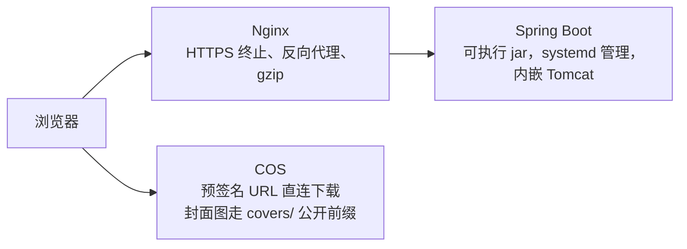

# 技术选型与工程结构（方案对比）

- **文档版本**：v0.5（架构已改为**严格前后端分离**，本文保留组件选型与技术栈结论）
- **创建日期**：2026-09-21
- **最后更新**：2026-09-21（§4.1 补入数据库二次论证：DAU 100 负载测算 + SQLite→MySQL 迁移成本）
- **文档状态**：**架构与部署以《前后端分离架构说明》v1.2 为准**；本文 §四（数据库 / 对象存储 / 部署组件）与 §六（脚手架步骤）仍有效，§三 视图层选型与 §五 目录结构**已作废**
- **关联文档**：`前后端分离架构说明.md`（**架构主文档**，v1.2）、`docs/doc/01-需求与范围/个人工具展示网站需求文档（PRD）.md` v1.7、`附录C-接口清单与统一约定.md` v0.8、`docs/doc/01-需求与范围/个人工具网站｜一期精简核心功能清单.md` v1.7、ADR-001/002
- **文档定位**：本文只解决"用什么实现"，不改动任何需求口径。与 PRD 冲突时以 PRD 为准

> **v0.5 变更摘要（2026-09-21 16:38）**：NecoOcean 提出"DAU 仅约 100 人，能否先用 SQLite 后续再接 MySQL"。经**负载测算 + 迁移成本分析**后**维持 MySQL 8**，但依据由"服务器内存规格"升级为"负载虽低但迁移成本高于收益"，完整论证固化于 §4.1.1~§4.1.3。**技术栈无任何变更。**

> **v0.3 变更摘要（2026-09-21 14:55）**：NecoOcean 明确要求**严格前后端分离**——前端独立项目负责页面与交互，后端仅通过 HTTP API 提供数据，**禁止服务端渲染 / 模板渲染 / 后端输出页面**。因此：① **移除 Thymeleaf**，后端仅 `@RestController`；② §三 视图层与 §五 目录结构作废，改以《前后端分离架构说明》为准；③ 前端定为 **Vue 3 + Vite**，且因"静态资源由源站提供 + 3 Mbps 带宽"，**首屏体积成为硬约束（gzip 后 ≤163 KB）**；④ 部署改为同源部署（Nginx 分发静态资源与 API 反代），**不启用 CORS**。
>
> **v0.2 变更摘要（2026-09-21 14:40）**：① 技术栈由 Python 系改为 **Java**（NecoOcean 决定）；② 服务器与对象存储确认为**腾讯云**；③ 因服务器为 **4 核 4 GB**，数据库定 **MySQL**（不再保留 SQLite 分支）；④ 新增 **3 Mbps 带宽**约束——这是本项目最紧的资源约束，直接决定"首屏 P75 ≤1.5s"能否达标，4.4 节给出必须执行的措施。
>
> **注意**：v0.1 的三方案对比（Python/SPA/Node）与 v0.2 的 Thymeleaf 选型均已作废，保留仅为决策留痕，**请勿按此实施**。

---

## 一、结论先行

**技术栈已定：Java 17 + Spring Boot 3.x 后端 + Vue 3 + Vite 前端（严格前后端分离）**，配套**腾讯云**：轻量应用服务器（4C4G，上海）+ COS。

**架构、目录结构、接口协作与部署演进，一律以《前后端分离架构说明》v1.2 为准。** 本文以下内容仅有 §四（组件选型）与 §六（脚手架步骤）继续有效。

**数据库结论**：**MySQL 8**（2026-09-21 二次论证后维持）。判定依据为"负载虽低但迁移成本高于收益"，**非**"SQLite 扛不住"——DAU 100 下 SQLite 性能完全够用。论证见 §4.1.1~§4.1.3。

---

## 二、决策约束（来自已定文档，不可违背）

选型不是自由发挥，以下 11 条已从 PRD v1.3 与附录C v0.4 定稿，构成方案的硬边界：

| # | 约束 | 取值 | 来源 |
|---|---|---|---|
| 1 | 部署形态 | **腾讯云轻量应用服务器，上海五区**，4C4G/SSD 40G/带宽 3Mbps/流量 300GB 月；**一期暂不公开上线** | PRD §9.1 / A-11 + NecoOcean 实购 |
| 2 | 文件存储 | **腾讯云 COS**（100GB 容量包，大陆通用，**私有读写**）+ CDN；单文件 ≤200 MB；`covers/` 前缀单独公开读 | PRD §4.3 / ADR-001 |
| 3 | 文件不走服务器 | 两阶段上传（前端直传 COS，凭证 60 分钟）；下载经 `/download/{file_id}` 302 至签名地址（5 分钟） | PRD §4.3 / 附录C C-28/C-29/C-05 |
| 4 | 性能指标 | 首屏完整加载 P75 ≤1.5s；≥50 并发错误率 <1% | PRD §5.1 |
| 5 | **带宽上限** | **3 Mbps（≈375 KB/s）**，流量包 300 GB/月 —— **本方案最紧约束** | 实购规格 |
| 6 | 数据模型 | 8 个实体，含 4 组复合索引与 2 组唯一约束 | PRD §8.1~§8.9 |
| 7 | 接口规模 | 48 个；`/api/v1/public/*`、`/api/v1/admin/*`、`/download/{file_id}`（刻意不带 `/api` 前缀） | 附录C §1 / §7 |
| 8 | 鉴权方式 | Cookie Session + 双提交 CSRF；公开写接口豁免 CSRF | 附录C §1 |
| 9 | 审核预留 | `audit_status` 一期默认 2；`message_audit_mode` 存于 `site_settings` | PRD §9.3 / §8.8 |
| 10 | 邮件 | 一期**不发送任何邮件**（无验证邮件、无回复通知） | PRD §4.2 / ADR-002 |
| 11 | 账号 | 单管理员账号；连续失败 5 次锁定 15 分钟 | PRD §9.4 |

**注**：备案归属地按 PRD §9.1 为**广西壮族自治区通信管理局**；服务器实际部署于上海不影响这一点（ICP 备案按主体归属地受理，与服务器所在地无关）。

---

| 5 | 数据模型 | 8 个实体，含 4 组复合索引与 2 组唯一约束 | PRD §8.1~§8.9 |
| 6 | 接口规模 | 48 个；`/api/v1/public/*`、`/api/v1/admin/*`、`/download/{file_id}`（刻意不带 `/api` 前缀） | 附录C §1 / §7 |
| 7 | 鉴权方式 | Cookie Session + 双提交 CSRF；公开写接口豁免 CSRF | 附录C §1 |
| 8 | 审核预留 | `audit_status` 一期默认 2；`message_audit_mode` 存于 `site_settings` | PRD §9.3 / §8.8 |
| 9 | 邮件 | 一期**不发送任何邮件**（无验证邮件、无回复通知） | PRD §4.2 / ADR-002 |
| 10 | 账号 | 单管理员账号；连续失败 5 次锁定 15 分钟 | PRD §9.4 |

---

## 三、技术栈决策留痕

> ⚠️ **本节与 §五 已作废**（2026-09-21 14:55，架构改为严格前后端分离）。以下内容仅作决策留痕，**请勿按此实施**。当前有效内容见《前后端分离架构说明》v1.2。

### 3.1 已定方案（v0.2 版本，部分已作废）

| 层 | 选型 | 说明 |
|---|---|---|
| 语言/运行时 | **Java 17（LTS）** | NecoOcean 指定；LTS 版本支持周期长，Spring Boot 3.x 的最低要求 |
| 应用框架 | **Spring Boot 3.x** | 内置 Tomcat、自动配置、生态成熟；单 jar 部署 |
| ~~视图层~~ | ~~**Thymeleaf**（服务端渲染）~~ | **⚠️ 已作废（v0.3）**：后端不输出任何页面，仅 `@RestController` 返回 JSON。见《前后端分离架构说明》§五 |
| ~~前端资源~~ | ~~**原生 CSS + 少量原生 JS**~~ | **⚠️ 已作废（v0.3）**：改为 **Vue 3 + Vite 独立前端项目**（不引 Pinia / UI 组件库） |
| 数据库 | **MySQL 8** | 见 §4.1 |
| ORM/迁移 | **Spring Data JPA + Flyway** | JPA 管实体映射，Flyway 管版本化迁移（对应 PRD §七"建表与迁移脚本"交付物） |
| 对象存储 | **腾讯云 COS**（`cos_api-bundle` SDK），⚠️ **建桶地域须选上海** | 见 §4.2 |
| 构建 | Maven（或 Gradle） | 按你的习惯；两者在本项目无实质差异 |
| 部署 | **可执行 jar + systemd**，Nginx 前置（同源部署） | 见 §4.3 与《前后端分离架构说明》§七 |

### 3.2 ~~为什么是 Thymeleaf 而非前后端分离~~（已作废）

> ⚠️ **本节结论已于 v0.3 被推翻。** NecoOcean 在 2026-09-21 14:55 明确要求**严格前后端分离**，本节的"不选 SPA"三条理由不再适用。保留原文仅为决策留痕，**请勿按此实施**。

以下为 v0.2 的原判断（已作废）：

Java 后端同时可选 Spring Boot + REST API + Vue/React。**本项目不选 SPA**，理由是三条与硬约束直接相关：

1. **3 Mbps 带宽下 SPA 首屏风险显著更高**。SPA 需要先下载 JS bundle（通常数百 KB 起）再发起 API 请求；服务端渲染则第一个响应就是完整 HTML，对窄带环境友好得多。这是**达标问题而非偏好问题**。
2. **SEO 需求**。工具专题页希望被搜索引擎收录以获取自然流量，服务端渲染无需额外做预渲染或 SSR 改造。
3. **后台页面交互简单**：表单提交 + 表格列表 + 筛选，无复杂状态管理。SPA 的收益（局部刷新、组件复用）在此规模下不足以抵消其构建链与部署复杂度。

**若二期交互显著变重**（如要把统计面板做成实时可交互看板），可单独把后台管理端拆成 SPA，前台仍保持服务端渲染——两者可共存，不必现在决定。

> **✅ 现行结论（v0.3+）**：采用 **Vue 3 + Vite 前端独立项目 + Spring Boot 仅 JSON API**。上面第 1 条（首屏风险）并未消失，而是被转化为**可量化的硬约束**——首屏 gzip ≤163 KB、并发峰值 ≤3 人达标，超出则执行阶段 1（前端产物迁 COS 静态托管）。第 2 条（SEO）作为**已知代价**列入演进，一期不公开上线故非阻塞。详见《前后端分离架构说明》§一、§八、§九。

### 3.3 备选与代价（如后续变更）

| 备选 | 代价 |
|---|---|
| ~~Spring Boot + Vue/React SPA~~ | **已于 v0.3 成为正式方案**（见 §3.2 现行结论）。原代价项仍成立：首屏需额外验证（3 Mbps 下已量化为"并发 ≤3 达标"）；多一套前端工程与构建链；SEO 需额外方案 |
| Spring Boot + HTMX / Alpine.js | ~~是 §3.2 结论的"进阶版"~~ **在前后端分离架构下已不适用**（HTMX 依赖服务端返回 HTML 片段，与"后端禁止输出页面"直接冲突） |
| Quarkus / Micronaut | 启动更快、内存更低（对 4 GB 机器有吸引力），但生态与资料少于 Spring Boot，个人项目不划算 |

---

## 四、组件选型（已定）

### 4.1 数据库：**MySQL 8**（已定，2026-09-21 16:38 二次论证后维持）

> **本节结论经两轮判断后维持不变，但依据不同。**
> - 第一轮（v0.2，依据"服务器规格"）：4 核 4 GB → 内存充足 → 排除 SQLite。理由成立但**逻辑不完整**：内存充足只能说明"用得起 MySQL"，不能说明"MySQL 优于 SQLite"。
> - 第二轮（2026-09-21 16:38，依据"负载测算 + 迁移成本"）：NecoOcean 提出"DAU 仅约 100 人，能否先用 SQLite，后续再接 MySQL"。重新测算后**仍维持 MySQL 8**，但排除理由改为 **"负载确实极低，但迁移成本高于收益"**。完整论证见 §4.1.1~§4.1.3。

| 选项 | 判定 | 理由 |
|---|---|---|
| **MySQL 8** | ✅ **选定并维持** | 负载维度与 SQLite 同样毫无压力（见 §4.1.1）；但在**迁移成本 / 运维成熟度 / 未来维护成本**三项上显著优于 SQLite。详见 §4.1.2 |
| MariaDB 10.11 | 可选替代 | 与 MySQL 8 在本项目用法上等价；如你更熟悉可直接替换 |
| SQLite | ❌ 排除（2026-09-21 重新论证） | **负载虽低但迁移成本高于收益**：省下约 100 MB 常驻内存，而本项目瓶颈是 **3 Mbps 带宽**而非内存；7 类迁移改造点集中在 **Flyway 历史脚本重写**与 **`LIKE` 检索语义差异**两处"以后难改"的位置。详见 §4.1.2 |
| PostgreSQL | ❌ 不推荐 | 功能强于本项目所需，收益不明显 |

**关键配置建议**（4 GB 机器需注意内存分配）：

| 参数 | 建议值 | 说明 |
|---|---|---|
| `innodb_buffer_pool_size` | `1G` | 约占内存 25%，兼顾 JVM 堆 |
| `max_connections` | `50` | 远超本站实际需求，避免无谓内存占用 |
| 字符集 | `utf8mb4` / `utf8mb4_0900_ai_ci` | 支持完整 Unicode（昵称、留言内容、中文文件名） |
| 时区 | `+08:00` | 与接口层 ISO 8601 带时区输出一致（附录C §1） |

**JVM 堆配置**：4 GB 机器上给应用 **`-Xmx1g`**（上限 1 GB）。剩余约 2 GB 留给 MySQL、系统与 Nginx，属安全区间；切勿把堆开到 2 GB 以上，否则 MySQL 与系统易被 OOM Killer 命中。

> 迁移策略：Flyway 管理 DDL 版本（对应 PRD §8 的 8 个实体与 §8.9 索引），`seed` 通过 Flyway 的 `V*__seed_*.sql` 或启动期 Runner 写入预置 4 分类与 `site_settings` 初始值。

---

#### 4.1.1 负载测算：本站数据库压力有多大（DAU 100）

测算基准取自 PRD 已定口径：日活 **100 人**、页面轮询间隔 **30 秒**、单次浏览触发 **3 个列表接口**、日新增留言 **5 条**、留言限流上限 **5 条 / 60 秒**（附录C §1.6）、留言内容上限 **3 KB**。

| 指标 | 测算过程 | 结果 |
|---|---|---|
| 人均日轮询次数 | 每个 5 分钟会话 × 120 s ÷ 30 s 轮询 × 3 接口 × 2 次会话 | ≈ 24 次请求/人/日 |
| **峰值读 QPS** | 100 人 × 12 次/人 ÷ 有效活跃窗口 | **≈ 0.14 QPS** |
| 日读请求总量 | 100 × 12（折算后） | ≈ 1,200 次/日 |
| **平均写 TPS** | 5 条留言/日 ÷ 86,400 s | **≈ 0.00006 TPS**（约 **4.8 小时 1 次写**） |
| 极限写 TPS | 限流上限 5 条 / 60 s | 0.083 TPS（且需持续灌入垃圾留言才能达到） |
| 10 年数据量 | 1,825 条/年 × 3 KB × 10 | **≈ 53 MB** |
| 5 年留言行数 | 5 条/日 × 365 × 5 | ≈ 9,125 条 |

**判定**：读 0.14 QPS、写每分钟不到 0.004 次、10 年数据不足 60 MB —— **这个负载量级下，SQLite 在纯性能维度完全够用**。SQLite 的单文件嵌入式模式在千级 QPS 读、百级 TPS 写以下都不构成瓶颈，本项目距该阈值有 3~4 个数量级余量。

**因此："数据库压力大"不成立，不能作为本次决策的依据。** 若仅按压力决策，SQLite 与 MySQL 打平；真正的分水岭在下一节。

#### 4.1.2 排除 SQLite 的真实理由：迁移成本高于收益

**收益侧（选 SQLite 能省什么）**：省约 **100 MB 常驻内存**（MySQL 8 空载典型占用）、省一次 MySQL 安装与 systemd 配置。而 4C4G 机器上内存本就有富余（JVM 已限 `-Xmx1g`），且**本项目最紧的约束是 3 Mbps 带宽（≈375 KB/s），与数据库无关**——省下这 100 MB 不解决任何实际瓶颈。

**成本侧（若先 SQLite 后迁 MySQL，需要改什么）**：改造点共 **7 类**，其中 2 类属于"现在便宜、以后昂贵"的性质：

| # | 改造点 | 具体内容 | 风险等级 |
|---|---|---|---|
| 1 | JDBC 连接配置与依赖 | 换 driver、改 `spring.datasource.*`、连接池参数（SQLite 用 `SQLiteDataSource`，MySQL 用 HikariCP） | 低 |
| 2 | **Flyway 历史脚本重写** | `AUTO_INCREMENT`（MySQL）↔ 无等价语法（SQLite 靠 `AUTOINCREMENT` / `INTEGER PRIMARY KEY`）；`DATETIME DEFAULT CURRENT_TIMESTAMP ON UPDATE ...` 无 SQLite 等价物；字符集/排序规则声明需整体替换。**历史脚本是 PRD §七 的正式交付物**，重写等于推翻已交付内容 | **高** |
| 3 | 数据搬迁 | 需额外写导出/导入脚本（`sqlite3 .dump` → 转换 → `mysql <`），并核对自增 ID、时间格式 | 中 |
| 4 | **检索行为差异** | SQLite 的 `LIKE` **默认大小写不敏感**，MySQL 取决于排序规则（`utf8mb4_0900_ai_ci` 亦不敏感，但 `_bin` / 部分排序规则敏感）。**B-29（留言搜索）验收用例需重新验证**，可能出现"迁移后搜索行为变了" | **高** |
| 5 | 时区与时间精度 | SQLite 无原生时区类型，时间以文本/整数存储；迁 MySQL 后须核对 `+08:00` 配置与毫秒精度，避免接口层 ISO 8601 输出偏移 | 中 |
| 6 | 索引与唯一约束语法 | 复合索引、唯一约束在两方言下写法有差异；`CREATE INDEX` 基本兼容但命名与部分选项不同 | 低 |
| 7 | 备份脚本 / 定时任务 / 监控项 | `mysqldump` 定时任务、慢查询日志、连接数告警等运维脚本全部需重写 | 中 |

**三条维持 MySQL 的理由（按权重排序）**：

1. **迁移成本集中在"以后难改"的位置**——第 2 类（Flyway 历史脚本）与第 4 类（`LIKE` 语义）不是加个依赖就能解决的，前者关联 PRD 交付物，后者关联验收用例。**现在选 SQLite 等于把成本延后并放大。**
2. **MySQL 的成本已在方案中沉淀**——PRD §8 的 8 个实体、§8.9 索引、Flyway 迁移策略、备份方案均已按 MySQL 编写；反向切换要动的文档与契约面更大。
3. **本决策不应以"压力"为依据**——两者在 DAU 100 下都毫无压力（§4.1.1）。应在**运维简便度 + 未来维护成本**维度决策，而 MySQL 在该维度胜出（工具链成熟、资料丰富、备份/恢复标准化、后续扩容路径清晰）。

**一句话结论**：*不是"MySQL 能扛住而 SQLite 扛不住"，而是"两者都扛得住，但中途从 SQLite 换 MySQL 的代价不划算"。*

#### 4.1.3 附：若后续仍要改判 SQLite 的最低兼容做法

若未来因部署环境受限（如必须单文件部署、无 systemd）而**重新考虑** SQLite，为把 §4.1.2 的成本压到最低，须从第一天起遵守以下约束：

| 约束 | 做法 | 目的 |
|---|---|---|
| 只用 JPA 标准注解 | 实体定义不依赖任何方言特性 | 保证 §4.1.2 第 1 类成本 |
| **不写原生 SQL** | 全部走 Spring Data JPA 派生查询或 JPQL；确需复杂查询时用 JPQL 而非 `@Query(nativeQuery = true)` | 规避第 4 类（`LIKE` 语义差异）——由 JPA 生成方言，行为一致 |
| Flyway 脚本避免方言特有语法 | 主键用 `BIGINT` + JPA `GenerationType.IDENTITY`（**不用 `AUTO_INCREMENT`**）；时间列在应用层赋值而非依赖 `DEFAULT CURRENT_TIMESTAMP` | 规避第 2 类（历史脚本重写） |
| 时间统一由应用层产生 | 实体用 `Instant` / `OffsetDateTime`，不使用数据库默认值 | 规避第 5 类 |
| 索引 / 唯一约束按最保守写法 | 只使用两方言共有的 `CREATE INDEX` / `UNIQUE` 基本语法 | 规避第 6 类 |

> ⚠️ **注意**：这套约束会渗透到 **PRD §8 全部 8 个实体的每一个字段定义**，并限制后续所有查询写法。**它带来的长期约束感，本身就超过维持 MySQL 的成本。** 因此该做法仅作为"环境受限时的退路"记录，**不作为当前建议**。

**已考虑并否决的折中选项**：本地开发用 **H2 的 MySQL 兼容模式**（`MODE=MySQL`）——看似"开发期轻量、生产期 MySQL"，但 H2 的 MySQL 兼容模式并非 100% 等价（尤其 `LIKE` 大小写、`ON UPDATE` 行为、索引推导），会导致"本地测试通过、生产行为不同"，**故不推荐**。正确做法是**本地也装 MySQL 8**（Docker 或本机安装），保证开发与生产同方言。

### 4.2 对象存储与 CDN：**腾讯云 COS + CDN**（已定）

你已购 **COS 标准存储容量包 100 GB（大陆通用）**，服务器为腾讯云，**同厂商配置成立**（避免跨厂商公网回源产生额外流量费与延迟）。

| 项 | 配置 |
|---|---|
| SDK | `cos_api-bundle`（Java） |
| 桶权限 | **私有读写**；仅 `covers/` 前缀配置公开读（PRD §4.3） |
| 上传 | 后端签发预签名 PUT 凭证（有效期 60 分钟）→ 前端直传 COS → 回调 `complete` 接口落库（附录C C-28/C-29） |
| 下载 | `/download/{file_id}` 校验后 302 至 COS 预签名 GET 地址（有效期 5 分钟），下载计数在重定向环节累加 |
| CDN | **建议一期暂只接入 COS 直链（预签名 URL），不上 CDN** —— 理由：一期不公开上线、访问量极低，CDN 会增加配置与费用维度；`PRD §4.3` 的"CDN 直链"可延后到正式公开前启用，届时仅需把域名从 COS 域名换为 CDN 域名 + 配防盗链，**不改业务代码** |
| 响应头 | `Content-Type: application/octet-stream` + `Content-Disposition: attachment` + `X-Content-Type-Options: nosniff`（防内联解析执行） |

**⚠️ 流量成本提醒**：容量包只抵扣**存储容量**，**不含外网下行流量**。COS 外网下行流量单独计费，须在控制台配置**流量用量告警**；同时依靠预签名 URL 的 5 分钟时效 + CDN 防盗链控制盗用风险。

### 4.3 部署形态



> **图例**：`-->` 请求流向。两条出边含义不同——静态资源与 API 经 Nginx，文件下载与封面图直连 COS。

| 项 | 方案 |
|---|---|
| Web 层 | Nginx：HTTPS 终止、`proxy_pass` 到应用端口、开启 gzip/brotli |
| 应用 | `java -jar` 可执行 jar，**systemd** unit 守护（启动/崩溃自恢复） |
| 反向代理要点 | 传递真实 IP（见下）——限流依赖 IP 哈希，取错 IP 会导致限流失效 |
| 进程数 | 单实例即可（4C4G 无需多实例）；如用多实例须注意 Session 共享问题 |

**真实 IP 传递（关键，易错）**：站前置 Nginx 后，应用侧 `request.getRemoteAddr()` 拿到的会是 `127.0.0.1`，导致"所有请求来自同一 IP"、限流把全站当成一个人。必须在 Nginx 配 `proxy_set_header X-Forwarded-For $proxy_add_x_forwarded_for;` 与 `X-Real-IP $remote_addr;`，并在 Spring 侧启用 `server.forward-headers-strategy=native`，取 IP 时读 `X-Forwarded-For` **第一段**，再做 SHA-256 后作为 `ip_hash`（PRD §4.2 要求不存明文 IP）。

**HTTPS 证书**：域名与证书在开发联调前就绪（PRD §9.1）。因服务器在腾讯云且域名若也在腾讯云解析，可直接申请免费证书并配置自动续期。

### 4.4 3 Mbps 带宽下的静态资源策略（贯穿性要求）

这是本方案最紧的资源约束，**375 KB/s 约等于：一张 300 KB 的封面图占用近 1 秒的全部带宽**。必须执行：

| 措施 | 说明 |
|---|---|
| 前端产物体积是硬约束 | **首屏 gzip 后 ≤163 KB**（JS ≤130 / CSS ≤15 / HTML ≤3 / API ≤15）。一期前端产物由源站 Nginx 提供；**图片一律走 COS，不得打进构建产物**。这是达标前提，不是优化项 |
| 封面图压缩与限尺寸 | 上传封面图时服务端校验 + 生成缩略图（首页卡片用缩略图，详情页用原图），控制单图 ≤120 KB |
| 开启压缩 | Nginx 对 HTML/CSS/JS/JSON 开 gzip（`gzip_comp_level 6`）；图片优先用 WebP |
| 缓存头 | 带内容指纹的 `/assets/*` 长缓存（`immutable, 1y`）；`index.html` 短缓存或不缓存 |
| 首屏测量 | 浏览器 DevTools 限速 3 Mbps 模拟验证 P75 ≤1.5s，**作为上线前必测项**；并发 ≥5 人不达标时直接执行《前后端分离架构说明》§8 阶段 1 |

> **注（v0.4 修订）**：本表原首行为"静态资源全走 COS/CDN，服务器只输出 HTML"——该表述在前后端分离架构下已作废（后端不输出任何 HTML）。现行策略见上表首行：**产物由源站提供但体积受限，图片走 COS**。

> **一项需要你评估的连带影响**：3 Mbps 是**服务器出网带宽**，与 COS 下载流量无关（下载走 COS）。因此 200 MB 文件下载**不受服务器带宽影响**——这是 ADR-001 选择对象存储的收益在此刻的具体体现。

---

## 五、工程目录结构

> ⚠️ **本节已作废**（2026-09-21 14:55）。当前目录结构见《前后端分离架构说明》§四（前端）与 §五（后端）。

以下为 v0.2 的 Spring Boot 单体目录（含 Thymeleaf），**保留仅为留痕**：

```
necoocean-tools/
├── pom.xml
├── src/main/java/com/necoocean/tools/
│   ├── ToolsApplication.java
│   ├── config/                       # 配置类
│   │   ├── WebMvcConfig.java         # 拦截器注册、静态资源映射、真实 IP 解析
│   │   ├── SecurityConfig.java       # 会话、密码编码器、CSRF 配置
│   │   ├── CosConfig.java            # COS 客户端 Bean、预签名逻辑参数
│   │   └── RateLimitConfig.java      # 限流参数（5 条/60 秒）
│   ├── common/                       # 横切能力
│   │   ├── ApiResponse.java          # 统一响应信封 {code, message, data}
│   │   ├── ErrorCode.java            # 错误码枚举（对应附录C §4，30 条）
│   │   ├── BizException.java         # 业务异常
│   │   ├── GlobalExceptionHandler.java  # @RestControllerAdvice 全局兜底
│   │   ├── PageResult.java           # 分页封装（page / page_size / total / items）
│   │   └── logging/                  # 【首个要建的横切能力】
│   │       ├── RequestLogFilter.java     # 请求日志 + traceId 注入
│   │       ├── LogMasker.java            # 敏感字段脱敏（邮箱、IP）
│   │       └── logback-spring.xml        # 结构化输出 + 按大小轮转 + 保留份数
│   ├── domain/                       # 实体与仓储（对应 PRD §8 的 8 个实体）
│   │   ├── entity/                   # Tool / ToolCategory / ReleaseNote / ResourceFile
│   │   │                             # Message / MessageReply / AdminUser / SiteSetting
│   │   └── repository/               # Spring Data JPA Repository
│   ├── dto/
│   │   ├── publicapi/                # 公开接口出入参（含输出白名单 DTO）
│   │   └── admin/                    # 后台接口出入参
│   ├── service/                      # 业务规则唯一落点
│   │   ├── MessageService.java       # 含 audit_status 流转、状态独立性
│   │   ├── FileService.java          # 含 is_latest / latest_version 事务同步（PRD §8.9）
│   │   ├── ToolService.java
│   │   ├── CategoryService.java      # 含"其他工具"不可删除校验
│   │   ├── SiteSettingService.java   # KV 读写 + 键白名单
│   │   ├── ExportService.java        # CSV + JSON 导出（不含邮箱为默认）
│   │   └── CosService.java           # 预签名上传/下载、对象键生成、异常文件检测
│   ├── web/
│   │   ├── publicapi/                # C-01 ~ C-08（含 C-04b）
│   │   ├── admin/                    # C-09 ~ C-46（C-47 延二期）
│   │   ├── DownloadController.java   # /download/{file_id}（不带 /api 前缀）
│   │   └── PageController.java       # 页面路由（首页/专题页/关于我/隐私政策）
│   ├── security/
│   │   ├── RateLimitInterceptor.java # IP 哈希限流
│   │   ├── CsrfInterceptor.java      # 双提交校验（公开写接口豁免）
│   │   └── LoginAttemptService.java  # 5 次失败锁定 15 分钟
│   └── scheduler/
│       └── OrphanCleanupJob.java     # 清理无数据库记录的对象存储残留
├── src/main/resources/
│   ├── application.yml / application-prod.yml
│   ├── templates/                    # Thymeleaf：首页 / 专题页 / 关于我 / 隐私政策 / 后台
│   ├── static/                       # 仅开发期本地资源；生产走 COS
│   └── db/migration/                 # Flyway：V1__init.sql、V2__seed_categories.sql 等
├── src/test/java/                    # 对应《验收用例集》的 B-1 ~ B-34 验收用例
├── deploy/
│   ├── nginx.conf.example
│   ├── app.service.example           # systemd unit
│   └── env.example                   # 环境变量清单（PRD §七 交付物要求）
└── README.md
```

**分层约定**：`web/` 只做参数校验与响应装配，`service/` 负责业务规则（PRD §8.9 的 `is_latest` 事务同步、审核状态流转、"其他工具"分类保护都落在此层，避免散落在 Controller 里），`domain/entity/` 只描述数据结构。**公开接口的输出白名单 DTO 单独放在 `dto/publicapi/`**，从结构上保证 `contact_email` 不可能被误带出去（PRD §2.3 的强制约束）。

**关于 Thymeleaf 与 REST 并存**：前台页面（`PageController` + templates）与 JSON 接口（`publicapi/`、`admin/`）共用同一套 `service/`。这与附录C §1 的响应信封约定一致——页面走模板渲染，接口走 `{code, message, data}`；两者**不共用 Controller**，避免为了复用而把页面渲染塞进 JSON 接口。

---

## 六、决策后第一步（脚手架任务清单）

技术栈与云环境已定，可按下述顺序启动。第 1、2 步**先于任何业务功能**（日志是排查线上问题的基础设施，事后补代价高；数据模型是所有业务代码的依赖）：

1. **建日志骨架**（`common/logging/` + `logback-spring.xml`）：结构化输出、按大小轮转与保留份数、敏感字段脱敏（邮箱、IP）、`traceId` 贯穿请求、全局异常兜底并**完整记录堆栈**（不只是 message）。
2. **建数据层**：8 个实体 + Flyway 初始化迁移（含 §8.9 全部索引与唯一约束）+ 预置 4 分类与 `site_settings` 初始值；产出 PRD §七要求的建表与迁移脚本。
3. **建契约骨架**：`ApiResponse` / `ErrorCode` / 分页封装 / 全局异常处理器 / 限流拦截器 / CSRF 拦截器 / 真实 IP 解析（§4.3 的易错点）。
4. **打通最小链路**：首页（C-01）→ 工具专题页（C-03）→ 留言列表（C-06）与提交（C-07），跑通验收用例 B-1、B-7、B-10。
5. **接入 COS**：两阶段上传（C-28/C-29）与下载 302（C-05），跑通 B-2、B-3、B-5、B-6；并完成 §4.4 的首屏实测。
6. **后台与配置**：登录（C-09，含 5 次/15 分钟锁定）、工具管理、留言管理、站点设置，最后补导出与残留对象清理任务。

---

## 七、决策状态

| # | 事项 | 状态 |
|---|---|---|
| 1 | 技术栈 | ✅ **已定（v0.3 修订）：Java 17 + Spring Boot 3.x（仅 JSON API） + Vue 3 + Vite 前端独立项目**；原"Thymeleaf 服务端渲染"已作废，见《前后端分离架构说明》 |
| 2 | 服务器规格 → 数据库 | ✅ **已定：MySQL 8**（§4.1）。**2026-09-21 16:38 二次论证后维持**——依据由"内存充足"改为"负载虽低但迁移成本高于收益"；DAU 100 下 SQLite 性能同样够用，**排除理由不是性能**（见 §4.1.1~§4.1.3） |
| 3 | 云厂商 → 对象存储 | ✅ **已定：腾讯云（轻量服务器 + COS）**；⚠️ **建桶地域须选上海**（与服务器一致，否则跨地域流量费） |
| 4 | 一期是否接入 CDN | ⚠️ **建议暂不接入**，先用 COS 预签名直链；正式公开前再启用（§4.2），届时不改业务代码。**注意演进第一步是前端产物迁 COS 静态托管，不是接 CDN** |
| 5 | Java 版本与构建工具 | ⚠️ 默认 **Java 17 + Maven**；若你倾向 Java 21（LTS）或 Gradle，告知即可 |
| 6 | 数据库部署形态 | ⚠️ 默认**在轻量服务器上安装 MySQL**（与 Spring Boot 同机）。若你希望用腾讯云数据库（TencentDB）独立托管，成本上升但运维更省事——按当前 4C4G 规格，本机安装足够 |
| 7 | 域名与备案 | ⚠️ 开发不阻塞；但备案周期以周计，**若计划公开上线，建议尽早启动**（PRD §9.1 / A-11） |
| 8 | 前端框架与仓库形态 | ✅ **已定（2026-09-21 16:19）：Vue 3 + Vite + 两个独立仓库**（见 PRD A-17） |
| 9 | 首屏指标口径 | ✅ **已定稿（2026-09-21 16:19）："持续请求节奏下的虚拟用户数，达标场景为并发 ≤3，超出执行阶段 1"**（已写入 PRD §5.1 / A-16） |

> 第 4~7 项均不阻塞脚手架启动，按默认值推进即可，随时可改。

---

> （注：部分内容可能由 AI 生成）
