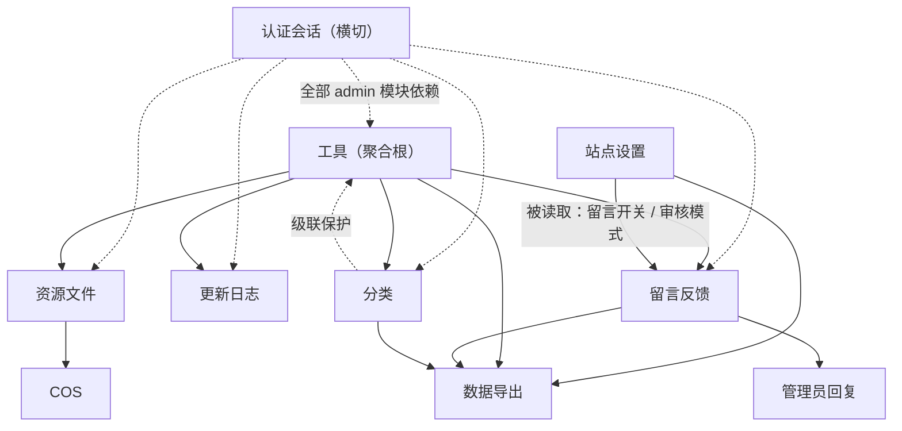
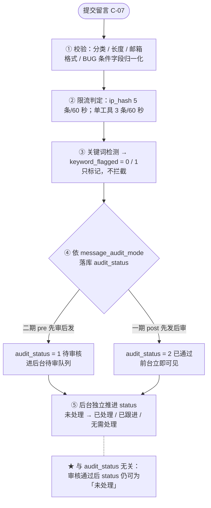
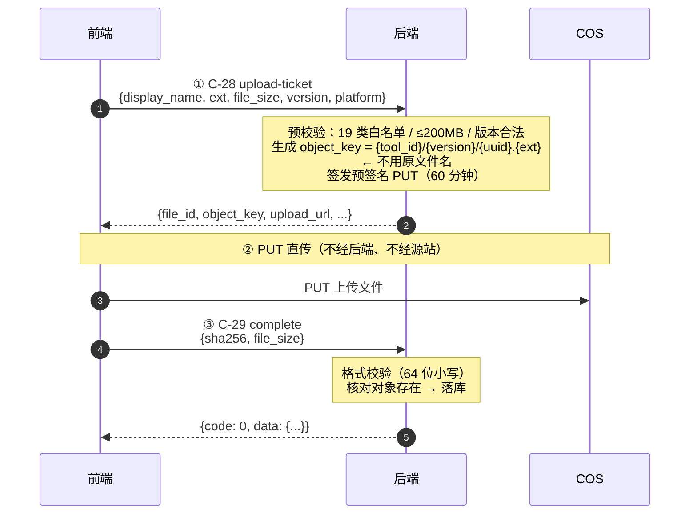
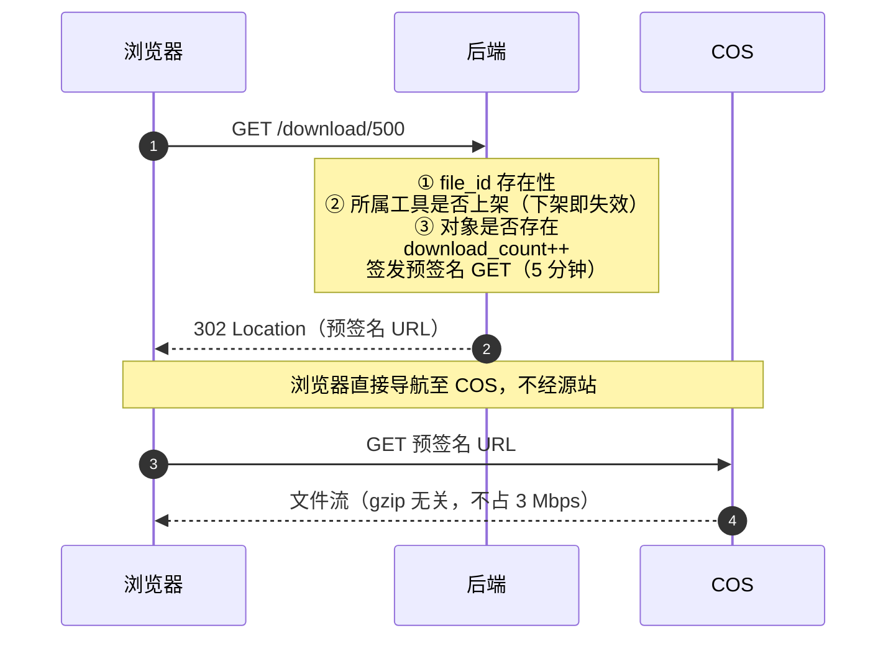
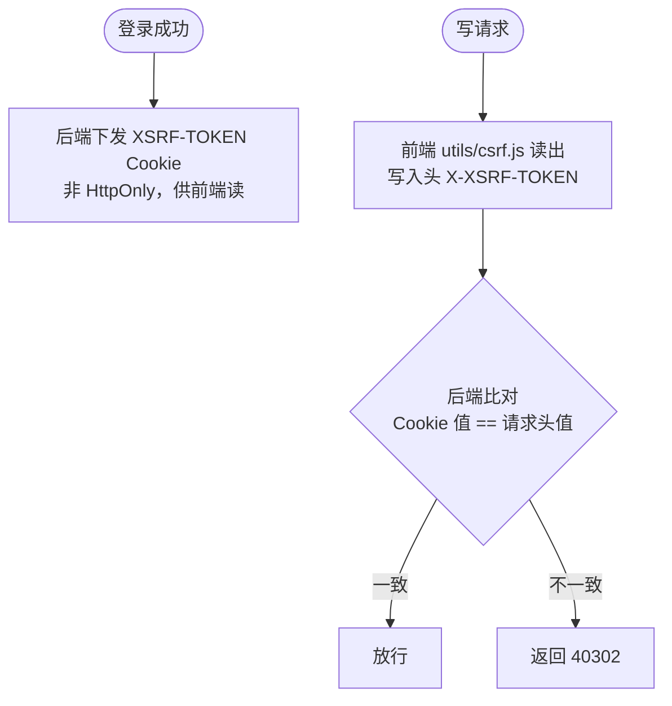
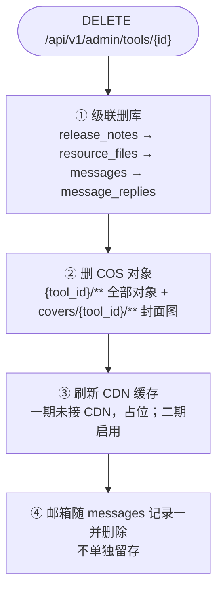

# 系统设计文档（System Design Document）

- **文档版本**：v1.0
- **创建日期**：2026-09-21
- **文档状态**：**由既有已定稿文档综合导出，无新增未决项**
- **文档定位**：本文是**面向开发落地的"怎么搭"文档**。架构决策的**事实源**仍是《前后端分离架构说明》v1.2；接口契约的事实源是《附录C》v0.8；需求的事实源是 PRD v1.7；数据字段的事实源是 PRD §8。
- **本文不做什么**：不重新论证技术选型、不引入新决策、不改变任何既有约定。凡本文与上述文档冲突，**一律以上述文档为准**。
- **关联文档**：`前后端分离架构说明.md` v1.2 · `docs/doc/01-需求与范围/个人工具展示网站需求文档（PRD）.md` v1.7 · `附录C-接口清单与统一约定.md` v0.8 · `技术选型与工程结构（方案对比）.md` v0.5 · `docs/doc/01-需求与范围/个人工具网站｜一期精简核心功能清单.md` v1.7 · `docs/doc/01-需求与范围/设计决策记录-托管范围与留言联系方式.md`（ADR-001/002）· `UI设计规范.md` v1.1

---

## 一、结论先行

**一句话**：这是一个**单机同源部署的严格前后端分离应用**——前端 Vue 3 SPA 只负责渲染与交互，后端 Spring Boot 只输出 JSON，MySQL 存元信息，腾讯云 COS 存二进制文件并承担全部大流量出口。

**系统由 4 个部署单元组成**：Nginx（唯一公网入口）、Spring Boot 应用、MySQL 8、腾讯云 COS。

**系统有 8 个业务模块**：工具管理、分类管理、更新日志、资源文件、留言反馈、站点设置、数据导出、认证会话。其中**留言反馈与资源文件是复杂度中心**——前者承载邮箱可见性约束与审核分期机制，后者承载"文件不经应用服务器"的两阶段直传流程。

**两条必须贯穿全系统的设计主线**：

| 主线 | 内涵 | 受影响模块 |
|---|---|---|
| **① 3 Mbps 带宽约束** | 源站出网 ≈375 KB/s 是**本项目最紧的物理约束**。据此推导出：前端产物体积硬预算 ≤163 KB、图片与下载**一律走 COS**、首屏达标场景为并发峰值 ≤3 人 | 前端构建、Nginx、资源文件、首页 |
| **② 邮箱与对象键白名单** | 公开接口在**序列化阶段**白名单输出，而非靠"前端不渲染"。这是"默认安全"与"默认暴露"的分野 | 留言反馈、资源文件（对象键） |

**当前状态**：**无未决项，可启动脚手架**。按 `技术选型与工程结构` §6 执行，**第一步是日志骨架**（logback-spring.xml + RequestLogFilter + LogMasker + 全局异常兜底），先于任何业务功能。

---

## 二、系统上下文与部署视图

### 2.1 系统上下文

**图 2-1　系统上下文**

```
        ┌──────────────┐      ┌──────────────────────┐
        │访客（匿名）  │      │管理员（单账号）      │
        │浏览 / 下载   │      │内容运营 / 留言处理   │
        │/ 提交留言    │      │/ 文件上传            │
        └──────┬───────┘      └───────────┬──────────┘
               │                          │
               └────────────┬─────────────┘
                            │
                            │ HTTPS :443  同一域名（同源）
                    ┌──────────────────────┐
                    │ NecoOcean 工具站     │
                    │ Nginx + Spring Boot  │
                    │ + MySQL              │
                    └───────┬──────────────┘
                            │
                    ┌──────────────────────┐
                    │ 腾讯云 COS（上海）   │
                    │ 私有读写 + covers    │
                    └──────────────────────┘
```

> **图例**：`│ ─ ┌ ┐ └ ┘ ├ ┤ ┬ ┴ ┼` 方框与连线；`▲ ▼ ► ◄` 流向箭头；`①` 步骤编号；`🔒` 敏感字段；`★` 关键约束；`⚠️` 风险提示。
> 本文档全部图表遵循《文档图表绘制规范》v1.0。

**外部依赖面刻意收窄为 1 个**（腾讯云 COS）。这是"避免过度设计"的直接体现：**不接 Redis、不接消息队列、不接邮件服务、不接监控平台、不接代码托管 CI**。

> ⚠️ 一期**不发送任何邮件**（含回复通知与验证邮件），因此无 SMTP 依赖。这同时消除了邮箱字段成为垃圾邮件入口的风险（ADR-002）。

### 2.2 部署拓扑

**图 2-2　部署拓扑（单台轻量服务器）**

```
腾讯云轻量应用服务器（上海五区 · 4C4G · SSD 40G · 3 Mbps · 流量包 300 GB/月）
├── Nginx（唯一监听 80/443 的进程）
│   ├── /  /assets/*  → /var/www/necoocean-tools/   （前端 dist，长缓存 + gzip）
│   ├── /api/v1/*     → proxy_pass 127.0.0.1:8080   （仅 JSON）
│   └── /download/*   → proxy_pass 127.0.0.1:8080   （后端返回 302）
├── Spring Boot（systemd 守护，仅监听 127.0.0.1:8080）
├── MySQL 8（仅监听 127.0.0.1）
└── CRON：mysqldump 每日备份 → 定期同步至 COS

外部服务（不经源站）：
└── 腾讯云 COS（上海）—— covers/ 公开前缀 + 预签名直连下载
```

**三个"仅回环"是安全设计的核心**：后端与数据库都不暴露公网端口，因此**不需要防火墙白名单**，攻击面收敛到一个 Nginx。代价是 Nginx 成为单点——但日活 100 人下可接受。

> 🔒 **部署后必查项（最高优先级）**：应用位于 Nginx 之后时 `getRemoteAddr()` 只会返回 `127.0.0.1`。若不做处理，**全站请求会被归入同一 IP 桶，留言限流将误伤全部访客**。必须：① Nginx 设 `proxy_set_header X-Forwarded-For $proxy_add_x_forwarded_for;`；② Spring Boot 设 `server.forward-headers-strategy=native`；③ 取 `X-Forwarded-For` **第一段**。取不到时**降级为不限流**，不得归入同一桶。

> ⚠️ **建桶地域必须选上海**（与轻量服务器一致）。跨地域会产生跨地域流量费并增加回源延迟——这是实施阶段最常见的疏漏。

### 2.3 请求路径分发表

| 路径 | 去向 | 缓存 | 说明 |
|---|---|---|---|
| `/`、`/assets/*` | Nginx 静态目录 | 指纹文件 `immutable` 1 年 | SPA `try_files` 回退至 `index.html` |
| `/api/v1/public/**` | Spring Boot | 列表/详情 `max-age=60`；留言列表 `no-store` | 匿名可访问 |
| `/api/v1/admin/**` | Spring Boot | `no-store` | 需登录态 + CSRF |
| `/download/{file_id}` | Spring Boot → 302 | `no-store` | 跳转至 COS 预签名地址 |
| 封面图 `covers/*` | **直连 COS**（不经源站） | COS 侧控制 | 不占 3 Mbps |
| 下载文件实体 | **直连 COS**（302 后） | 签名时效 5 分钟 | 不占 3 Mbps，不进应用内存 |

---

## 三、分层架构

### 3.1 四个部署单元与各自职责

**图 3-1　四个部署单元分层**

```
┌────────────────────────────────────────────────────────────────────────────────┐
│① 浏览器 · Vue 3 SPA                                                            │
│   视图层（views/）→ 接口适配层（api/）→ fetch + credentials                    │
│   职责：渲染、交互、体验层校验、轮询、直传 COS                                 │
│   不职责：业务规则判定（一律由后端裁定）                                       │
└─────────────────────────────────┬──────────────────────────────────────────────┘
                                  │ HTTPS 同源（无 CORS）
┌─────────────────────────────────▼──────────────────────────────────────────────┐
│② Nginx                                                                         │
│   gzip / 静态托管 / 反代 / SPA 回退 / 真实 IP 透传                             │
└─────────────────────────────────┬──────────────────────────────────────────────┘
                                  │ 127.0.0.1:8080
┌─────────────────────────────────▼──────────────────────────────────────────────┐
│③ Spring Boot · 五层                                                            │
│   web/（Controller）→ service/（业务规则唯一落点）                             │
│     → repository/（JPA）→ MySQL 8                                              │
│   logging/ · security/ · config/ · common/ 为横切层                            │
└─────────────────────────────────┬──────────────────────────────────────────────┘
                                  │ COS SDK（服务端）+ 预签名 URL（客户端直连）
┌─────────────────────────────────▼──────────────────────────────────────────────┐
│④ 腾讯云 COS                                                                    │
│   covers/ 前缀公开读 | 其余私有读写 | 对象键 {tool_id}/{version}/{uuid}.{ext}  │
└────────────────────────────────────────────────────────────────────────────────┘
```

### 3.2 后端五层结构

| 层 | 包 | 职责 | 明确不做 |
|---|---|---|---|
| **接入层** | `web/publicapi/`、`web/admin/`、`DownloadController` | 路由、参数绑定与校验、DTO ↔ 领域对象转换、调用 service | ❌ 不写业务规则 |
| **业务层** | `service/` | **全部业务规则的唯一落点**：审核流转、`is_latest` 事务同步、分类删除保护、限流判定、导出构造 | ❌ 不感知 HTTP |
| **领域层** | `domain/entity/`、`domain/repository/` | 实体映射（8 个）、Spring Data JPA 仓库接口 | ❌ 不写跨聚合的编排逻辑 |
| **横切层** | `logging/`、`security/`、`config/`、`common/` | 日志与脱敏、限流/CSRF/登录锁定、统一信封与全局异常、Jackson 与 COS 配置 | —— |
| **调度层** | `scheduler/OrphanCleanupJob` | 每日清理无记录的 COS 残留对象 | —— |

**这一分层的关键约束**：**业务规则只允许出现在 `service/`**。理由是审核分期机制要求"改一个默认值即可切换策略"（见 §6.1）——如果判定逻辑散落到 Controller 或前端，二期切换就会变成多点改动。

### 3.3 后端模块清单（按包）

| 模块 | 核心类 | 关键职责 |
|---|---|---|
| 统一契约 | `ApiResponse`、`PageResult`、`ErrorCode`、`BizException`、`GlobalExceptionHandler` | 信封 `{code,message,data}`；30 条错误码；全局兜底保证**堆栈必落日志** |
| 认证会话 | `SecurityConfig`、`LoginAttemptService`、`CsrfInterceptor` | Cookie Session（12h、`HttpOnly;Secure;SameSite=Lax`）；双提交 CSRF；5 次失败锁 15 分钟 |
| 限流 | `RateLimitInterceptor` | `ip_hash`（`sha256(ip+盐)`）**5 条/60 秒**；单工具 3 条/60 秒；**不存明文 IP** |
| 工具 | `ToolService` | CRUD、上下架、slug 不可变校验、级联删除（含 COS 对象） |
| 分类 | `CategoryService` | CRUD、"其他工具"**不可删除**保护、名称唯一 |
| 更新日志 | （随 ToolService） | `(tool_id, version)` 联合唯一 |
| 资源文件 | `FileService` + `CosService` | 两阶段直传、`is_latest` 事务同步、SHA-256 格式校验、异常文件标记 |
| 留言 | `MessageService` | 分类校验、BUG 条件字段归一化、关键词标记、审核流转、置顶、状态 |
| 站点设置 | `SiteSettingService` | KV 读写 + **键白名单**；未定义键拒绝写入 |
| 导出 | `ExportService` | CSV / JSON；`include_email` 默认 false；**写审计记录** |
| 日志 | `RequestLogFilter`、`LogMasker`、`logback-spring.xml` | traceId 贯穿、邮箱与 IP 脱敏、结构化 + 轮转保留 |

### 3.4 前端模块清单

| 模块 | 路径 | 职责 |
|---|---|---|
| 接口适配层 | `api/http.js` | **唯一发请求的地方**：信封解析、`code` → 文案映射、CSRF 头注入、401 跳登录 |
| 公开接口 | `api/publicApi.js` | C-01 ~ C-08 |
| 后台接口 | `api/adminApi.js` | C-09 ~ C-46 |
| 视图 | `views/` | Home / ToolDetail / About / Privacy / admin（Login、Tools、Messages、Categories、Settings） |
| 组件 | `components/` | ToolCard、MessageItem、Pagination、FileUploader |
| 工具 | `utils/csrf.js`、`utils/format.js` | 读 `XSRF-TOKEN` Cookie；时间与文件大小格式化 |
| 样式 | `styles/` | 极简自建 CSS 变量，**不引任何 UI 库 / 动画库 / webfont** |

**前后端职责的分界线（易犯错处）**：前端**只做体验层校验**（如邮箱格式提示），**业务规则一律由后端裁定**。

> **典型反例**：前端**不得**自行判断"命中关键词就不提交"。关键词只标记不拦截（PRD §4.2），前端若擅自拦截就变成了"过滤"，与既定口径冲突。

---

## 四、核心模块设计

### 4.1 模块总览与依赖关系

**图 4-1　模块总览与依赖关系**



> **图例**：`-->` 强依赖（聚合内）；`-.->` 弱依赖（横切 / 引用）。
> **依赖规则**：工具是聚合根，**分类、更新日志、资源文件、留言都挂在工具上**。因此删除工具会级联触发最多 4 个下游清理动作（PRD §8.9）。站点设置是**被读取方**（留言开关、审核模式）而非依赖方。

### 4.2 留言反馈模块（复杂度中心 Ⅰ）

**数据流与状态机**

留言有两个**相互独立**的状态字段，这是本模块最易被误解之处：

| 字段 | 管什么 | 取值 | 生命周期 |
|---|---|---|---|
| `audit_status` | **是否公开** | 1 待审核 / 2 已通过 / 3 未通过 | 审核在前 |
| `status` | **管理员内部处理进度** | 1 未处理 / 2 已处理 / 3 已跟进 / 4 无需处理 | 处理在后 |

**图 4-2　留言提交流程与双状态独立性**



> **图例**：`-->` 流转；`-.->` 附加说明；`{}` 判定节点；`([])` 起止节点。
> **为什么两者不可合并**：合并后无法表达"已公开但未处理"这个**正常且高频**的状态。

**审核分期的实现机制（改一个默认值即可切换）**

| 层 | 一期 | 二期 | 切换成本 |
|---|---|---|---|
| 数据库 | 新留言 `audit_status` 默认写 `2` | 默认改为 `1` | 改一个默认值 |
| C-07 提交 | 按策略置值 | 逻辑不变 | 无 |
| **C-06 列表** | 查询条件 `audit_status = 2` | **条件完全相同** | **无** |
| C-45/C-46 审核 | 实现但无数据可操作 | 投入使用 | 无 |
| C-34 后台列表 | 支持筛选，默认视图不筛 | 默认视图改 `audit_status = 1` | 改一个默认值 |
| 前台文案 | 不展示审核说明 | 增"审核通过后公开显示" | 改一处文案 |

**机制能成立的关键**：C-06 的查询条件在两种策略下**完全相同**——一期所有留言的 `audit_status` 都是 `2`，条件自然成立；二期待审留言被自动过滤。因此**代码里不需要任何 if/else 分支**。

> ⚠️ **唯一必须守住的底线**：一期**不得省略 `audit_status` 字段**。若为"简化"延到二期再加，二期需：改表 + 数据回填 + 改 C-06 条件 + 改 C-07 返回结构 + 新增审核接口 + 回归全部留言用例。同理 `messages(audit_status, created_at)` 索引**一期即建**，避免二期在线加索引。

**邮箱可见性约束（强制）**

| 出口 | 是否含 `contact_email` | 实现方式 |
|---|---|---|
| C-06 公开留言列表 | ❌ **绝不** | 公开 DTO 白名单序列化 |
| C-34 后台留言**列表** | ❌ 不含，仅返回 `has_email` 布尔 | 避免截图/投屏批量泄露 |
| C-35 后台留言**详情** | ✅ **唯一**可见处 | —— |
| C-42 导出 | ⚠️ 默认 false，**显式勾选**方含 | 须写审计（操作人+时间+是否含邮箱） |

**公开接口的禁止字段全集**：`contact_email`、`ip_hash`、`status`、`audit_status`、`tool_id`。

> **实现方式建议**：为公开接口定义独立的 `MessagePublicResource` 白名单序列化器，而非在通用序列化器上加 `exclude`。前者"**默认安全**"（新增字段默认不暴露），后者"**默认暴露**"（新增字段默认泄露）——两者在迭代中的失败方向相反。

### 4.3 资源文件模块（复杂度中心 Ⅱ）

**为什么必须两阶段直传**：单文件上限 200 MB，而源站总带宽 3 Mbps。若文件经应用服务器中转，单次上传需 **8.9 分钟**，且期间**全站其他访客的页面基本打不开**（带宽被均分至接近 0）。这是全系统唯一需严肃对待的并发风险。

**上传时序**

**图 4-3　文件两阶段直传时序**



> **图例**：`->>` 同步请求；`-->>` 响应；`Note over` 内部处理说明。

**关键设计点与已知限制**

| 项 | 约定 | 理由 |
|---|---|---|
| 对象键 | `{tool_id}/{version}/{uuid}.{ext}`，**不含原始文件名** | 原始名可能含路径穿越字符、中文、重名 |
| 上传凭证 | **60 分钟** | 须覆盖 200 MB 上传耗时（家中上行 30 Mbps 约 55 秒，10 Mbps 约 2.7 分钟） |
| 下载签名 | **5 分钟** | 与上传区分；时效短降低链接外流风险 |
| SHA-256 | **方案 A**：信任前端回传 + 后端仅格式校验 | 后端自行计算需回拉 200 MB，与"不经应用服务器"目标直接冲突；单管理员场景无篡改动机 |
| ⚠️ 方案 A 局限 | 前端计算有 bug 或传输丢包时，**落库校验值将失去意义** | 缓解：管理员上传后**自行下载核对一次**（成本约 1 分钟） |
| ⚠️ 不得的做法 | **不得**用 COS ETag 冒充 SHA-256 | 分片上传的 ETag 不是 MD5，语义不同，会误导用户核对 |
| 孤儿对象 | 每日定时清理，**判定窗口 ≥24 小时** | 避免误删"刚上传、尚未回调确认"的对象 |
| 异常文件 | 库有记录但对象不存在 → `40405` + 后台标记 | 不静默失败 |

**`is_latest` 同步规则（跨表一致性）**

管理员将某文件设为推荐版本时，**须在同一事务内**完成三步，保证任一时刻同工具内至多一条 `is_latest = 1`：

1. 同工具其余记录 `is_latest` 置 0
2. 目标记录 `is_latest` 置 1
3. `tools.latest_version`（冗余字段）更新为该记录 `version`

> **新增文件默认不自动成为推荐版本**，须管理员显式指定——避免误传的旧版本覆盖推荐标识。

**下载时序**

**图 4-4　文件下载时序（302 重定向至 COS）**



> **图例**：`->>` 同步请求；`-->>` 响应；`302` 为重定向响应。
> **下载计数在服务端重定向环节累加**，不依赖 COS 日志——这样计数与业务库同事务语义，且不引入日志解析依赖。一期**仅累加不展示**，供二期统计。

### 4.4 认证会话模块

| 项 | 设计 | 理由 |
|---|---|---|
| 方式 | **Cookie Session**，非 JWT | 单管理员 + 同源部署下复杂度最低：浏览器自动管理，前端无需处理存储/刷新/过期 |
| Cookie 属性 | `HttpOnly`、`Secure`、`SameSite=Lax`、`Path=/` | `HttpOnly` 防 XSS 读取会话标识 |
| 有效期 | 12 小时，**无滑动续期** | 个人站，兼顾安全与免重复登录 |
| 登录锁定 | 连续失败 **5 次** → 锁 **15 分钟** | `failed_attempts` 计数，成功清零 |
| 前端行为 | 一律 `credentials: 'include'`；**不读取、不存储会话标识** | 会话由浏览器全权管理 |
| 登录态判断 | 前端**不自行判断**，以 `40100` 为准并跳登录页 | 避免会话过期时前端状态与后端不一致 |

**CSRF 双提交**

**图 4-5　CSRF 双提交校验流程**



> **图例**：`-->` 流转；`{}` 判定节点；`([])` 起止节点。

**豁免**：公开写接口（C-07 留言提交）**豁免 CSRF**——它无登录态、无越权前提，攻击者伪造提交与用户本人提交效果一致。但仍受限流约束。

> **同源部署带来的直接收益**：前端与 API 共用域名，浏览器视为同源，因此**无 CORS 预检（OPTIONS）、无 CORS 头维护、Cookie 天然可携带**。这是分离架构下"避免过度设计"最直接的收获——**只有当前后端不同域名时才需要 CORS**。
>
> ⚠️ 若未来演进到阶段 1（前端迁 COS 静态托管 + 独立域名），**必须**补 CORS 白名单（`Allow-Credentials: true`）并将 Cookie 改为 `SameSite=None; Secure`。

### 4.5 站点设置与数据导出

**站点设置**：采用 KV 表（`site_settings`）而非固定列，新增配置项**无需改表与迁移脚本**。写入按**键白名单**约束，未定义的键拒绝写入。

一期键清单：`site_name`、`home_intro`、`copyright`、`icp_number`、`announcement`、`about_content`、`privacy_content`、`message_board_enabled`、`message_audit_mode`（`post`/`pre`）。

> **`message_audit_mode` 是审核分期的切换点**，放在配置表中使二期切换**无需改代码、无需重新部署**（Q-18）。

**富文本 XSS 防护**：`about_content` / `privacy_content` 支持 Markdown 或受限 HTML，**须做 XSS 过滤**——禁止 `<script>`、事件属性、`iframe`，渲染时作为页面正文而非可执行内容。

**数据导出**：`type`（tools/messages/replies/all）× `format`（csv/json）。邮箱默认不含，勾选后 CSV 与 JSON **均增加该字段**；**导出文件表头须带可见警示**；**导出动作写审计记录**（操作人 + 时间 + `include_email` + `type`/`format`）。

---

## 五、数据模型

### 5.1 实体关系

**图 5-1　实体关系图（8 实体 / 5 条外键）**

```mermaid
erDiagram
    tool_categories ||--o{ tools : "1:N"
    tools ||--o{ release_notes : "1:N"
    tools ||--o{ resource_files : "1:N"
    tools ||--o{ messages : "1:N"
    messages ||--o{ message_replies : "1:N"

    tool_categories {
        int id PK
        varchar name UK "唯一"
        int sort_order
    }
    site_settings {
        varchar key PK "KV 主键"
        text value
        datetime updated_at
    }
    admin_users {
        int id PK
        varchar username UK
        varchar password_hash
        datetime last_login_at
        int failed_attempts
    }
    tools {
        int id PK
        varchar name
        varchar slug UK "不可变"
        varchar summary
        varchar cover_object_key "NULL"
        int category_id FK
        varchar platforms "CSV 存 / 数组传"
        text tutorial "Markdown"
        varchar repo_url "NULL"
        varchar web_url "NULL"
        varchar latest_version "冗余字段"
        tinyint status "1上架/0下架"
        date developed_at "NULL 手填"
        datetime created_at
        datetime updated_at
    }
    release_notes {
        int id PK
        int tool_id FK
        varchar version "与 tool_id 联合唯一"
        text content
        datetime released_at
    }
    resource_files {
        int id PK
        int tool_id FK
        varchar version
        varchar display_name
        varchar object_key "敏感"
        varchar ext
        bigint file_size
        char sha256 "64 位小写"
        varchar platform "NULL"
        tinyint is_latest "同工具唯一"
        int download_count
        datetime created_at
    }
    messages {
        int id PK
        int tool_id FK "必填"
        varchar nickname
        varchar contact_email "NULL 敏感"
        tinyint category "1~4"
        varchar content "≤2000"
        varchar os_platform "NULL 条件字段"
        varchar tool_version "NULL 条件字段"
        text repro_steps "NULL 条件字段"
        tinyint status "1~4 内部进度"
        tinyint is_pinned
        tinyint audit_status "1待审/2通过/3未通过"
        tinyint keyword_flagged
        datetime audited_at "NULL"
        varchar ip_hash "敏感"
        datetime created_at
    }
    message_replies {
        int id PK
        int message_id FK
        text content
        datetime created_at
    }
```



> **图例**：`||--o{` 一对多（1:N）；`PK` 主键；`FK` 外键；`UK` 唯一约束；**"敏感"** 表示该字段不得出现在公开接口（白名单序列化排除）；**"NULL 条件字段"** 表示仅 BUG 类留言填充。
> **`site_settings` 与 `admin_users` 为独立配置域**，与业务表无外键关联。

**8 个实体，5 条外键关系，全部为 1:N。** 无多对多、无自关联、无继承——这是"避免过度设计"在数据层的体现。

### 5.2 索引设计

| 表 | 索引 | 服务的查询 |
|---|---|---|
| `tools` | `slug` **唯一** | 专题页按 slug 查找 |
| `tool_categories` | `name` **唯一** | 分类名称冲突校验 |
| `release_notes` | `(tool_id, version)` **联合唯一** | 同工具同版本仅一条日志 |
| `resource_files` | `(tool_id, version)` | 下载区按工具+版本列出 |
| `messages` | `(tool_id, created_at)` | **专题页留言分页**（最热查询） |
| `messages` | `(audit_status, created_at)` | **公开列表过滤**，一期即建 |
| `messages` | `(is_pinned, created_at)` | 置顶优先排序 |
| `messages` | `status`、`category` | 后台筛选 |

> **`messages(audit_status, created_at)` 一期即建的第 3 个理由**：一期该字段恒为 `2`，索引区分度虽低，但**可在二期切换时立即生效、无需 DDL 变更窗口**。留言数据会累积，二期再补需在线加索引或短暂锁表——对本项目属可避免的运维动作。

### 5.3 字段级设计要点

| 要点 | 设计 | 理由 |
|---|---|---|
| **`platforms` 双形态** | 库内 CSV 字符串 `Windows,Android`；接口层**字符串数组** | 服务端序列化层双向转换，前端只见数组。入库前校验取值 ∈ {Windows, Android, Mac, 通用} |
| **枚举返回** | `{value, label}` 双字段（如 `category: 3, category_text: "BUG报错"`） | **前端不硬编码中文映射**，枚举文案改动时前端无需同步发版 |
| **时间** | ISO 8601 带 `+08:00`；服务端一律存 UTC+8 | 前端按浏览器时区展示 |
| **布尔** | 数据库 `tinyint(1)` → 接口层转 `true/false` | **不返回 0/1** |
| **空值** | 统一 `null`，**不用空字符串代替** | 前端据此区分"未填写"与"填了空" |
| **ID** | `int`，不用雪花 ID | 个人站量级无需分布式 ID |
| **文件大小** | `int` / `bigint`（字节），前端格式化 | 200 MB = 209715200 |
| **`developed_at` vs `updated_at`** | 前者作者手填、仅展示、**不参与排序筛选**；后者系统维护、用于首页卡片排序 | 两者语义独立，可并存且不要求一致 |

### 5.4 级联删除策略

删除工具时**必须同时完成 4 件事**，不遗留任何仍可访问的残留副本：

**图 5-2　级联删除四步**



> **图例**：`-->` 顺序执行；`([])` 起始节点。四步**必须全部完成**，缺一即产生可访问的残留副本。

> ⚠️ **删除不可恢复**，须前置二次确认。**留言删除**属应急处置通道（PRD §9.3），用于合规响应。

---

## 六、关键机制设计

### 6.1 审核分期的平滑切换机制

**问题**：终态是"先审后发"，一期先上线"先发后审"。若一期不预留，二期需同时改接口、改前端、改数据库——典型返工。

**解法：单一开关 + 默认值**。三处设计使切换成本降到最低：

1. **接口形状按终态定义**，两种策略下**完全一致**（仅 `audit_status` 返回值不同）
2. **C-06 查询条件恒定**为 `audit_status = 2`，代码中**无分支判断**
3. **切换点收敛到 `site_settings.message_audit_mode`**，改配置即可，**无需改代码或重新部署**

**二期切换须同步修订的文档位置**（届时执行，此处登记备查）：PRD §2.1.2 / §4.1 / §4.2 / §9.3、《待确认参数台账》A-5、《验收用例集》（新增审核用例）；接口 C-34 默认视图。

### 6.2 带宽预算与性能设计

**3 Mbps = 375 KB/s 是硬天花板**。首屏预算按此反推：

| 资源 | gzip 后预算 | 超出时的处理 |
|---|---|---|
| JS（Vue runtime + app + router） | **≤130 KB** | 路由级代码分割（专题页/后台各自独立 chunk）；超标则评估换 Preact |
| CSS | **≤15 KB** | 极简自建样式，不引完整 CSS 框架 |
| HTML | ≤3 KB | 天然满足 |
| 首屏 API 响应 | ≤15 KB | 分页默认 20 条 + gzip |
| **首屏合计** | **≤163 KB** | **超过即视为阻塞问题，须先优化再上线** |

**据此得到的并发结论**：

| 并发 | 首屏传输耗时 | 判定 |
|---|---|---|
| 1 人 | 0.42 s | 达标 |
| 3 人 | 1.27 s | **达标上限** |
| 5 人 | 2.12 s | 超标 |
| 10 人 | 4.24 s | 超标 |

> 该测算**未计入 RTT、TLS 握手与 JS 解析执行**，实际只会更差。首屏 P75 ≤1.5s 的**达标场景为并发峰值 ≤3 人**。

**三条流量路径的天花板相差三个数量级**：

| 路径 | 承载方 | 单次体积 | 并发天花板 |
|---|---|---|---|
| ① 动态 API | 源站 | 2~10 KB | **≈58 并发用户** |
| ② 前端产物 | 源站（一期） | 163 KB/首屏 | **≈3 并发用户** ← **真瓶颈** |
| ③ 软件包 / 封面图 | COS | 最大 200 MB | **≈154 人同时满速** |

**降压措施（必须落实）**：gzip 全开、构建产物内容指纹 + 长缓存、**图片与下载一律走 COS**、API 精简 + 分页 20 条、上线前 DevTools 3 Mbps 限速实测。

> **并发口径纪律**：PRD §5.1 的"≥50 并发用户"是**持续请求节奏下的虚拟用户数**，**不得**理解为"50 个用户的全部请求在同一瞬间返回"。后者需 1 秒内出网 ≥500 KB，超过管道能力，**在阶段 1 完成前不可验收**。压测脚本须按此口径编写。

**`/download` 不走源站的意义是"隔离"而非"变快"**：若下载走源站，**只要有一个人在源站下载 200 MB 包，全站其他人的首屏加载在数分钟内不可用**（带宽被均分至接近 0）。走 COS 后该风险**归零**——下载与网页物理隔离。

### 6.3 安全设计汇总

| 面 | 措施 |
|---|---|
| 传输 | HTTPS（证书 + 强制跳转） |
| 会话 | Cookie Session，`HttpOnly` + `Secure` + `SameSite=Lax`，12h |
| CSRF | 双提交（`XSRF-TOKEN` Cookie ↔ `X-XSRF-TOKEN` 头）；公开写接口豁免 |
| 暴力破解 | 登录 5 次失败锁 15 分钟；单账号 |
| 限流 | `ip_hash`（不存明文 IP）5 条/60 秒；单工具 3 条/60 秒 |
| 隐私 | 邮箱公开接口白名单排除；**仅 C-35 可见**；导出默认不含 + 审计 |
| 上传 | 19 类扩展名白名单 + MIME 双重校验；**显式拒绝** `.html/.htm/.svg/.js`（存储型 XSS）与 `.php/.jsp/.asp/.sh/.bat/.cmd`；≤200 MB；随机键名 |
| 存储 | COS 私有读写，**仅 `covers/` 前缀公开读**；下载经 302 + 5 分钟签名 |
| 下发 | CDN/响应带 `X-Content-Type-Options: nosniff`，以附件形式下发 |
| 后台 | 管理入口路径建议随机化（`/manage-{8位随机串}/`），经环境变量配置，**不在代码仓库硬编码** |
| 内容 | 富文本 XSS 过滤（禁 `<script>`/事件属性/`iframe`） |
| 合规 | 留言日常管理 + 应急删除能力（`DELETE messages` + 待复核队列） |

### 6.4 日志与可观测性（首个要建的能力）

按 NecoOcean 的**日志能力审查**永久约定，日志骨架先于任何业务功能。四个维度：

| 维度 | 设计 |
|---|---|
| **自动生成机制** | `RequestLogFilter` 生成 `traceId` 并贯穿全链；关键路径（启动、请求入口、COS 调用、调度任务、异常分支）统一收口到 logger，**不使用散落的 `print`** |
| **持久化** | 结构化输出 + `logback-spring.xml` 定义轮转（rotation 大小 / 保留份数 / 过期清理）；敏感字段经 `LogMasker` 脱敏（**邮箱、IP**） |
| **级别规范** | 统一 DEBUG/INFO/WARN/ERROR；可经配置调整而不改代码；**避免误用**（可恢复异常不打 ERROR，业务分支不留 DEBUG 空洞） |
| **异常与堆栈** | `GlobalExceptionHandler`（`@RestControllerAdvice`）全局兜底，`BizException` 与未知异常分流；**完整记录堆栈而非仅 message**，保留 cause 链 |

---

## 七、演进路径与当前边界

### 7.1 四阶段演进（每步由明确触发条件启动）

| 阶段 | 触发条件 | 动作 | 业务代码改动 | CDN |
|---|---|---|---|---|
| **0（当前）** | 日活 ~100，并发峰值 ≤3 | 单机：Nginx + Spring Boot + MySQL；前端产物由源站提供 | —— | 否 |
| **1** | 并发峰值 >3，或实测首屏 P75 >1.5s | **前端产物迁 COS 静态托管 + 自定义域名**；源站只承载 API；后端加 CORS 白名单 | **不动** | **否** |
| **2** | 流量继续增长，或广西以外访问占比上升 | COS 接 **CDN**；配 Referer 防盗链 | **不动** | **是** |
| **3** | 应用 CPU/内存成为瓶颈 | 后端多实例 + Nginx 负载均衡；**Session 外置**（Redis 或存库）；数据库迁 TencentDB | 需改会话存储 | 否 |
| **4** | 带宽长期吃紧 | 升级带宽套餐，或依阶段 1/2 已分流后重估 | 配置层 | 视情况 |

> **阶段 1 是关键的低成本降压点**：把源站出网从"HTML + JS + CSS + API"降到"仅 API"（单次几 KB），3 Mbps 约束基本解除，且**不违反"暂不引入 CDN"的要求**——COS 静态托管与 CDN 是两回事（CDN 是在 COS 之上叠加的加速层，阶段 2 才引入）。

### 7.2 明确的非目标（一期不做）

| 项 | 理由 |
|---|---|
| 在线预览 / 编辑 / 转码 / 在线运行 | ADR-001 严格排除；"托管"= 仅文件存储与下载 |
| Web 工具内嵌运行、Python 沙箱 | ADR-001 排除项；Web 型工具只给站外链接 |
| 断点续传、版本比对、分享协作、仓库托管 | ADR-001 排除项 |
| 转发访客二次回复（评论线程化） | 增加审核成本；一期回复方仅管理员 |
| 任何邮件发送（含回复通知、验证邮件） | 一期全部关闭，避免成为垃圾邮件入口 |
| 回复通知闭环 | 列入二期；一期用户需自行回访查看 |
| 独立"全部工具列表页" | 工具数量少，首页即承载全量 |
| WebSocket 长连接 | 30 秒轮询足够，避免过度设计 |
| Redis / 消息队列 / Docker / 服务网格 / 微前端 | 日活 100 人下引入只增加运维面 |
| Pinia/Vuex、UI 组件库、动画库、webfont | 直接击穿 163 KB 首屏预算 |
| CI/CD、容器化发布 | 脚本化发布已足够 |
| 反馈统计可视化面板 | 一期仅做数量计数 |

### 7.3 已知代价（诚实标注）

| 代价 | 影响 | 应对 |
|---|---|---|
| **首屏弱于 SSR** | 需下载 JS 再渲染，3 Mbps 下并发 3 人即达上限 | §6.2 性能预算 + §7.1 阶段 1 |
| **SEO 需额外方案** | SPA 首屏 HTML 为空壳，爬虫难抓工具页内容 | 一期不公开上线、日活 100，**非阻塞**；若后续做 SEO 再引入预渲染或 SSR |
| **SHA-256 真实性依赖前端** | 前端计算有 bug 时落库校验值失效 | 管理员上传后自行下载核对一次 |
| 前端多一个构建环节 | 需维护 Node 构建链 | **服务器不装 Node**，本地构建后上传 dist |
| Nginx 是单点 | 无冗余 | 日活 100 人下可接受 |

### 7.4 上线前置（开发不阻塞，公开访问阻塞）

| 项 | 状态 |
|---|---|
| ICP 备案（广西壮族自治区通信管理局） | **周期以周计，是公开访问的唯一硬前置**。建议**尽早启动**，即便一期暂不公开上线 |
| 域名注册与解析 | 公开前办理 |
| COS 建桶（**地域必须选上海**） | 部署前核对 |
| COS 用量告警配置 | **优先级高于并发**——外网下行流量单独计费（容量包仅抵存储） |
| 备案号展示 | `icp_number` 为空时前台**不渲染该行**（未备案不展示） |

---

## 八、开发顺序建议

按依赖关系与风险排序，**第一步是日志骨架**（符合永久约定）：

| 序 | 模块 | 产出 | 为什么这个顺序 |
|---|---|---|---|
| 1 | **日志骨架** | `logback-spring.xml` + `RequestLogFilter` + `LogMasker` + `GlobalExceptionHandler` | 后续所有模块都依赖它；晚建则需回头补埋点 |
| 2 | **统一契约** | `ApiResponse` / `ErrorCode`（30 条）/ `BizException` / `PageResult` | 全部接口的共同底座 |
| 3 | **数据层** | 8 实体 + Flyway 迁移脚本（含全部索引，**含 `audit_status` 索引**） | 索引一期即建，避免二期 DDL 变更窗口 |
| 4 | **认证会话** | `SecurityConfig` + CSRF + 登录锁定 | 后台接口的前置 |
| 5 | **公开读接口** | C-01 ~ C-06、C-08 | 前端可先行联调，**但注意公开 DTO 白名单从第一天就落实** |
| 6 | **留言提交** | C-07 + 限流 + 关键词标记 + 审核落库 | 与 5 同属公开面 |
| 7 | **后台管理** | C-13 ~ C-44 | 依赖 4 |
| 8 | **文件两阶段直传** | C-28 ~ C-33 + COS 签名 + 孤儿清理 | **风险最高**，需在真实 COS 环境验证 |
| 9 | **导出** | C-42 + 审计记录 | 依赖 3 / 7 |
| 10 | **前端** | 路由骨架 → 首页 → 专题页 → 留言区 → 后台 | 可自序 5 起并行联调 |

> **可并行的分界**：后端 1~3 为串行前置；4~7 与 8~9 可并行；前端自 5 完成后即可并行推进。

---

## 九、验收口径（可直接执行）

| 面 | 口径 |
|---|---|
| 后端形态 | jar 内**不得含任何 `.html`**；除 `/download/{file_id}` 的 302 外，**所有响应 `Content-Type` 必为 `application/json`** |
| 契约 | 48 接口 / 30 错误码；统一信封 `{code,message,data}`；分页固定 `{page,page_size,total,items}`（注：实现层按附录C §1.4 的 `list` + `pagination` 结构） |
| 隐私 | 公开留言接口返回体中**不含 `contact_email`**（对应 B-10）；C-34 列表不含邮箱仅含 `has_email` |
| 审核预留 | `messages.audit_status` 字段与 `(audit_status, created_at)` 索引**一期即存在**；C-45/C-46 接口可调用 |
| 首屏 | gzip 后 ≤163 KB；DevTools 限速 3 Mbps 实测 **P75 ≤1.5s @ 并发峰值 ≤3 人** |
| 接口并发 | **持续请求节奏下** 50 虚拟用户，错误率 <1%，留言列表不串页/不重复/不丢失 |
| 限流 | 60 秒内提交 10 条留言触发限流（B-14，阈值 5 严格小于 10） |
| 下载 | 响应 302 至 COS 预签名地址（5 分钟）；`download_count` 在重定向环节累加 |
| 真实 IP | Nginx 后取 `X-Forwarded-For` 首段；取不到时**降级为不限流**，不得归入同一桶 |
| 日志 | 关键路径有埋点；`traceId` 贯穿；异常**完整记录堆栈**；邮箱与 IP 已脱敏；有轮转与保留周期 |

---

## 十、本文与其他文档的边界

| 问题 | 去哪里查 |
|---|---|
| 某接口的请求/响应字段、错误码 | **附录C** v0.8 |
| 某字段的类型/长度/默认值/索引 | **PRD §8** |
| 为什么选 Vue 3 / 为什么不用 Redis / 为什么维持 MySQL | **架构说明** §2；**技术选型** §4.1.1~4.1.3 |
| 某功能一期做不做、验收用例编号 | **一期清单** v1.7；**PRD §6**、《验收用例集》 |
| 视觉令牌、组件规范、动效时序 | **UI设计规范** v1.1 |
| "托管"到底含什么、邮箱为什么只给管理员 | **ADR-001 / ADR-002** |

---

> （注：部分内容可能由 AI 生成）
